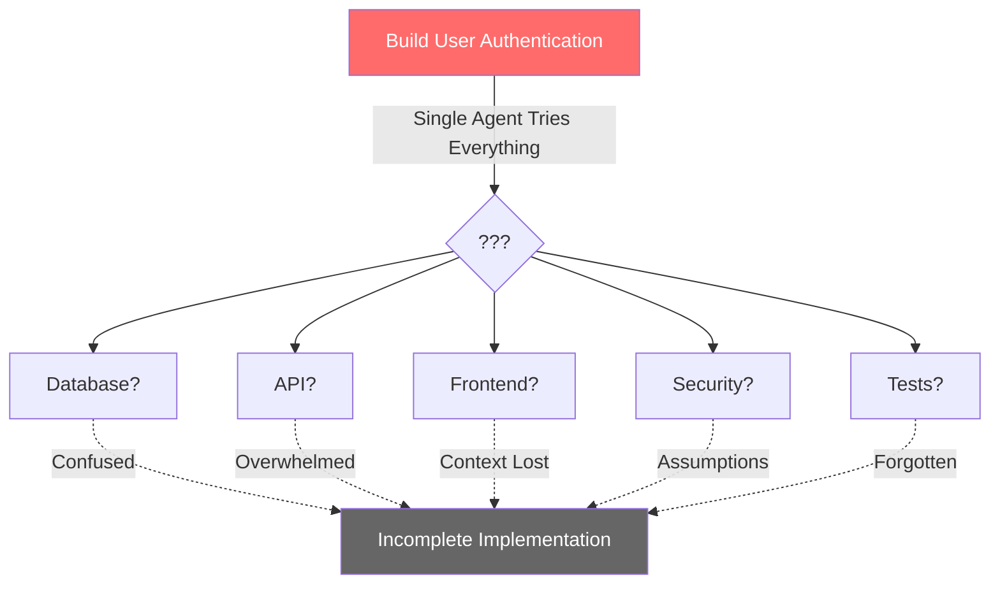
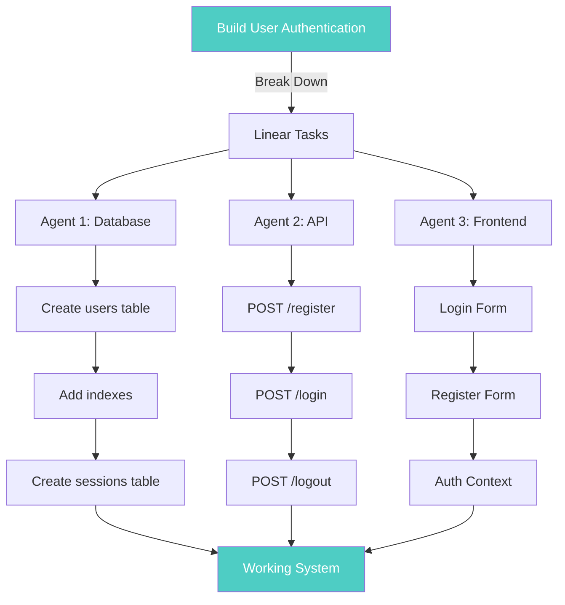

Skip to content

## Navigation Menu

      Toggle navigation                                                                                                                Sign in                                         Appearance settings                                                                                                                  Search or jump to...

# Search code, repositories, users, issues, pull requests...

                                                           Search                                                                                                                                 Clear

                                                                                  Search syntax tips

# Provide feedback

We read every piece of feedback, and take your input very seriously. Include my email address so I can be contacted Cancel Submit feedback

# Saved searches

## Use saved searches to filter your results more quickly

                                                                                                          Name                                                                                    Query

            To see all available qualifiers, see our documentation.                                                                       Cancel              Create saved search                                                Sign in                                                         Sign up                                               Appearance settings                      Resetting focus                                                 You signed in with another tab or window. Reload to refresh your session.        You signed out in another tab or window. Reload to refresh your session.        You switched accounts on another tab or window. Reload to refresh your session.          Dismiss alert                                                                                                                                     rinadelph        /    **      Agent-MCP    **    Public
               -                     Notifications    You must be signed in to change notification settings

-                   Fork     132
-                                   Star          1k


      Agent-MCP is a framework for creating multi-agent systems that enables coordinated, efficient AI collaboration through the Model Context Protocol (MCP). The system is designed for developers building AI applications that benefit from multiple specialized agents working in parallel on different aspects of a project.

### License

                     View license                                           1k          stars                                132          forks                                Branches                                Tags                                Activity                                                        Star                                        Notifications    You must be signed in to change notification settings

# rinadelph/Agent-MCP

                           mainBranchesTagsGo to fileCodeOpen more actions menu

## Folders and files

| Name | Name | Last commit message | Last commit date |
| ---- | ---- | ------------------- | ---------------- |

|

## Latest commit

 

## History

300 Commits |
| agent-mcp-node | agent-mcp-node |   |   |
| agent_mcp | agent_mcp |   |   |
| assets/images | assets/images |   |   |
| docs | docs |   |   |
| testing-suite | testing-suite |   |   |
| .env.example | .env.example |   |   |
| .gitignore | .gitignore |   |   |
| .nvmrc | .nvmrc |   |   |
| AGENT_MCP_COMPARISON_ANALYSIS.md | AGENT_MCP_COMPARISON_ANALYSIS.md |   |   |
| CONTRIBUTING.md | CONTRIBUTING.md |   |   |
| LICENSE | LICENSE |   |   |
| LOCAL_EMBEDDINGS_GUIDE.md | LOCAL_EMBEDDINGS_GUIDE.md |   |   |
| README.md | README.md |   |   |
| TASK_CREATION_REQUIREMENTS_ANALYSIS.md | TASK_CREATION_REQUIREMENTS_ANALYSIS.md |   |   |
| TOOL_BY_TOOL_LOGIC_COMPARISON.md | TOOL_BY_TOOL_LOGIC_COMPARISON.md |   |   |
| mcp.json | mcp.json |   |   |
| package-lock.json | package-lock.json |   |   |
| package.json | package.json |   |   |
| pyproject.toml | pyproject.toml |   |   |
| requirements.txt | requirements.txt |   |   |
| View all files |

## Repository files navigation

# Agent-MCP

🚀 **Advanced Tool Notice**: This framework is designed for experienced AI developers who need sophisticated multi-agent orchestration capabilities. Agent-MCP requires familiarity with AI coding workflows, MCP protocols, and distributed systems concepts. We're actively working to improve documentation and ease of use. If you're new to AI-assisted development, consider starting with simpler tools and returning when you need advanced multi-agent capabilities.

💬 **Join the Community**: Connect with us on Discord to get help, share experiences, and collaborate with other developers building multi-agent systems.

Multi-Agent Collaboration Protocol for coordinated AI software development.

Think **Obsidian for your AI agents** - a living knowledge graph where multiple AI agents collaborate through shared context, intelligent task management, and real-time visualization. Watch your codebase evolve as specialized agents work in parallel, never losing context or stepping on each other's work.

## Why Multiple Agents?

Beyond the philosophical issues, traditional AI coding assistants hit practical limitations:

- **Context windows overflow** on large codebases
- **Knowledge gets lost** between conversations
- **Single-threaded execution** creates bottlenecks
- **No specialization** - one agent tries to do everything
- **Constant rework** from lost context and confusion

## The Multi-Agent Solution

Agent-MCP transforms AI development from a single assistant to a coordinated team:

**Real-time visualization** shows your AI team at work - purple nodes represent context entries, blue nodes are agents, and connections show active collaborations. It's like having a mission control center for your development team.

### Core Capabilities

**Parallel Execution** Multiple specialized agents work simultaneously on different parts of your codebase. Backend agents handle APIs while frontend agents build UI components, all coordinated through shared memory.

**Persistent Knowledge Graph**

Your project's entire context lives in a searchable, persistent memory bank. Agents query this shared knowledge to understand requirements, architectural decisions, and implementation details. Nothing gets lost between sessions.

**Intelligent Task Management**

Monitor every agent's status, assigned tasks, and recent activity. The system automatically manages task dependencies, prevents conflicts, and ensures work flows smoothly from planning to implementation.

## Quick Start

### Python Implementation (Recommended)

```
# Clone and setup
git clone https://github.com/rinadelph/Agent-MCP.git
cd Agent-MCP

# Check version requirements
python --version  # Should be >=3.10
node --version    # Should be >=18.0.0
npm --version     # Should be >=9.0.0

# If using nvm for Node.js version management
nvm use  # Uses the version specified in .nvmrc

# Configure environment
cp .env.example .env  # Add your OpenAI API key
uv venv
uv install

# Start the server
uv run -m agent_mcp.cli --port 8080 --project-dir path-to-directory

# Launch dashboard (recommended for full experience)
cd agent_mcp/dashboard && npm install && npm run dev
```

### Node.js/TypeScript Implementation (Alternative)

```
# Clone and setup
git clone https://github.com/rinadelph/Agent-MCP.git
cd Agent-MCP/agent-mcp-node

# Install dependencies
npm install

# Configure environment
cp .env.example .env  # Add your OpenAI API key

# Start the server
npm run server

# Or use the built version
npm run build
npm start

# Or install globally
npm install -g agent-mcp-node
agent-mcp --port 8080 --project-dir path-to-directory
```

## MCP Integration Guide

### What is MCP?

The **Model Context Protocol (MCP)** is an open standard that enables AI assistants to securely connect to external data sources and tools. Agent-MCP leverages MCP to provide seamless integration with various development tools and services.

### Running Agent-MCP as an MCP Server

Agent-MCP can function as an MCP server, exposing its multi-agent capabilities to MCP-compatible clients like Claude Desktop, Cline, and other AI coding assistants.

#### Quick MCP Setup

```
# 1. Install Agent-MCP
uv venv
uv install

# 2. Start the MCP server
uv run -m agent_mcp.cli --port 8080

# 3. Configure your MCP client to connect to:
# HTTP: http://localhost:8000/mcp
# WebSocket: ws://localhost:8000/mcp/ws
```

#### MCP Server Configuration

Create an MCP configuration file ( `mcp_config.json`):

```
{
  "server": {
    "name": "agent-mcp",
    "version": "1.0.0"
  },
  "tools": [
    {
      "name": "create_agent",
      "description": "Create a new specialized AI agent"
    },
    {
      "name": "assign_task",
      "description": "Assign tasks to specific agents"
    },
    {
      "name": "query_project_context",
      "description": "Query the shared knowledge graph"
    },
    {
      "name": "manage_agent_communication",
      "description": "Handle inter-agent messaging"
    }
  ],
  "resources": [
    {
      "name": "agent_status",
      "description": "Real-time agent status and activity"
    },
    {
      "name": "project_memory",
      "description": "Persistent project knowledge graph"
    }
  ]
}
```

#### Using Agent-MCP with Claude Desktop

-

**Add to Claude Desktop Config**:

Open `~/Library/Application Support/Claude/claude_desktop_config.json` (macOS) or equivalent:

```
{
  "mcpServers": {
    "agent-mcp": {
      "command": "uv",
      "args": ["run", "-m", "agent_mcp.cli", "--port", "8080"],
      "env": {
        "OPENAI_API_KEY": "your-openai-api-key"
      }
    }
  }
}
```

-

**Restart Claude Desktop** to load the MCP server

-

**Verify Connection**: Claude should show "🔌 agent-mcp" in the conversation

#### MCP Tools Available

Once connected, you can use these MCP tools directly in Claude:

**Agent Management**

- `create_agent` - Spawn specialized agents (backend, frontend, testing, etc.)
- `list_agents` - View all active agents and their status
- `terminate_agent` - Safely shut down agents

**Task Orchestration**

- `assign_task` - Delegate work to specific agents
- `view_tasks` - Monitor task progress and dependencies
- `update_task_status` - Track completion and blockers

**Knowledge Management**

- `ask_project_rag` - Query the persistent knowledge graph
- `update_project_context` - Add architectural decisions and patterns
- `view_project_context` - Access stored project information

**Communication**

- `send_agent_message` - Direct messaging between agents
- `broadcast_message` - Send updates to all agents
- `request_assistance` - Escalate complex issues

#### Advanced MCP Configuration

**Custom Transport Options**:

```
# HTTP with custom port
uv run -m agent_mcp.cli --port 8080

# WebSocket with authentication
uv run -m agent_mcp.cli --port 8080 --auth-token your-secret-token

# Unix socket (Linux/macOS)
uv run -m agent_mcp.cli --port 8080
```

**Environment Variables**:

```
export AGENT_MCP_HOST=0.0.0.0          # Server host
export AGENT_MCP_PORT=8000              # Server port
export AGENT_MCP_LOG_LEVEL=INFO         # Logging level
export AGENT_MCP_PROJECT_DIR=/your/project  # Default project directory
export AGENT_MCP_MAX_AGENTS=10          # Maximum concurrent agents
```

### MCP Client Examples

#### Python Client

```
import asyncio
from mcp import Client

async def main():
    async with Client("http://localhost:8000/mcp") as client:
        # Create a backend agent
        result = await client.call_tool("create_agent", {
            "role": "backend",
            "specialization": "API development"
        })

        # Assign a task
        await client.call_tool("assign_task", {
            "agent_id": result["agent_id"],
            "task": "Implement user authentication endpoints"
        })

        # Query project context
        context = await client.call_tool("ask_project_rag", {
            "query": "What's our current database schema?"
        })
        print(context)

asyncio.run(main())
```

#### JavaScript Client

```
import { MCPClient } from '@modelcontextprotocol/client';

const client = new MCPClient('http://localhost:8000/mcp');

async function createAgent() {
  await client.connect();

  const agent = await client.callTool('create_agent', {
    role: 'frontend',
    specialization: 'React components'
  });

  console.log('Created agent:', agent.agent_id);

  await client.disconnect();
}

createAgent().catch(console.error);
```

### Troubleshooting MCP Connection

**Connection Issues**:

```
# Check if MCP server is running
curl http://localhost:8000/mcp/health

# Verify WebSocket connection
wscat -c ws://localhost:8000/mcp/ws

# Check server logs
uv run -m agent_mcp.cli --port 8080 --log-level DEBUG
```

**Common Issues**:

- **Port conflicts**: Change port with `--port` flag
- **Permission errors**: Ensure OpenAI API key is set
- **Client timeout**: Increase timeout in client configuration
- **Agent limit reached**: Check active agent count with `list_agents`

### Integration Examples

**VS Code with MCP**: Use the MCP extension to integrate Agent-MCP directly into your editor workflow.

**Terminal Usage**:

```
# Quick task assignment via curl
curl -X POST http://localhost:8000/mcp/tools/assign_task \
  -H "Content-Type: application/json" \
  -d '{"task": "Add error handling to API endpoints", "agent_role": "backend"}'
```

**CI/CD Integration**:

```
# GitHub Actions example
- name: Run Agent-MCP Code Review
  run: |
    uv run -m agent_mcp.cli --port 8080 --daemon
    curl -X POST localhost:8000/mcp/tools/assign_task \
      -d '{"task": "Review PR for security issues", "agent_role": "security"}'
```

## How It Works: Breaking Complexity into Simple Steps

```
graph LR
    A[Step 1] --> B[Step 2] --> C[Step 3] --> D[Step 4] --> E[Done!]
    style A fill:#4ecdc4,color:#fff
    style E fill:#ff6b6b,color:#fff

```

                          Loading

Every task can be broken down into linear steps. This is the core insight that makes Agent-MCP powerful.

### The Problem with Complex Tasks

```
graph TD
    A["Build User Authentication"] -->|Single Agent Tries Everything| B{???}
    B --> C[Database?]
    B --> D[API?]
    B --> E[Frontend?]
    B --> F[Security?]
    B --> G[Tests?]
    C -.->|Confused| H[Incomplete Implementation]
    D -.->|Overwhelmed| H
    E -.->|Context Lost| H
    F -.->|Assumptions| H
    G -.->|Forgotten| H
    style A fill:#ff6b6b,color:#fff
    style H fill:#666,color:#fff

```

                          Loading

### The Agent-MCP Solution

```
graph TD
    A["Build User Authentication"] -->|Break Down| B[Linear Tasks]
    B --> C["Agent 1: Database"]
    B --> D["Agent 2: API"]
    B --> E["Agent 3: Frontend"]

    C --> C1[Create users table]
    C1 --> C2[Add indexes]
    C2 --> C3[Create sessions table]

    D --> D1[POST /register]
    D1 --> D2[POST /login]
    D2 --> D3[POST /logout]

    E --> E1[Login Form]
    E1 --> E2[Register Form]
    E2 --> E3[Auth Context]

    C3 --> F[Working System]
    D3 --> F
    E3 --> F

    style A fill:#4ecdc4,color:#fff
    style F fill:#4ecdc4,color:#fff

```

                          Loading

Each agent focuses on their linear chain. No confusion. No context pollution. Just clear, deterministic progress.

## The 5-Step Workflow

### 1. Initialize Admin Agent

```
You are the admin agent.
Admin Token: "your_admin_token_from_server"

Your role is to:
- Coordinate all development work
- Create and manage worker agents
- Maintain project context
- Assign tasks based on agent specializations

```

### 2. Load Your Project Blueprint (MCD)

```
Add this MCD (Main Context Document) to project context:

[paste your MCD here - see docs/mcd-guide.md for structure]

Store every detail in the knowledge graph. This becomes the single source of truth for all agents.

```

The MCD (Main Context Document) is your project's comprehensive blueprint - think of it as writing the book of your application before building it. It includes:

- Technical architecture and design decisions
- Database schemas and API specifications
- UI component hierarchies and workflows
- Task breakdowns with clear dependencies

See our MCD Guide for detailed examples and templates.

### 3. Deploy Your Agent Team

```
Create specialized agents for parallel development:

- backend-worker: API endpoints, database operations, business logic
- frontend-worker: UI components, state management, user interactions
- integration-worker: API connections, data flow, system integration
- test-worker: Unit tests, integration tests, validation
- devops-worker: Deployment, CI/CD, infrastructure

```

Each agent specializes in their domain, leading to higher quality implementations and faster development.

### 4. Initialize and Deploy Workers

```
# In new window for each worker:
You are [worker-name] agent.
Your Admin Token: "worker_token_from_admin"

Query the project knowledge graph to understand:
1. Overall system architecture
2. Your specific responsibilities
3. Integration points with other components
4. Coding standards and patterns to follow
5. Current implementation status

Begin implementation following the established patterns.

AUTO --worker --memory

```

**Important: Setting Agent Modes**

Agent modes (like `--worker`, `--memory`, `--playwright`) are not just flags - they activate specific behavioral patterns. In Claude Code, you can make these persistent by:

- Copy the mode instructions to your clipboard
- Type `#` to open Claude's memory feature
- Paste the instructions for persistent behavior

Example for Claude Code memory:

```
# When I use "AUTO --worker --memory", follow these patterns:
- Always check file status before editing
- Query project RAG for context before implementing
- Document all changes in task notes
- Work on one file at a time, completing it before moving on
- Update task status after each completion

```

This ensures consistent behavior across your entire session without repeating instructions.

### 5. Monitor and Coordinate

The dashboard provides real-time visibility into your AI development team:

**Network Visualization** - Watch agents collaborate and share information **Task Progress** - Track completion across all parallel work streams **Memory Health** - Ensure context remains fresh and accessible **Activity Timeline** - See exactly what each agent is doing

Access at `http://localhost:3847` after launching the dashboard.

## Advanced Features

### Specialized Agent Modes

Agent modes fundamentally change how agents behave. They're not just configuration - they're behavioral contracts that ensure agents follow specific patterns optimized for their role.

**Standard Worker Mode**

```
AUTO --worker --memory

```

Optimized for implementation tasks:

- Granular file status checking before any edits
- Sequential task completion (one at a time)
- Automatic documentation of changes
- Integration with project RAG for context
- Task status updates after each completion

**Frontend Specialist Mode**

```
AUTO --worker --playwright

```

Enhanced with visual validation capabilities:

- All standard worker features
- Browser automation for component testing
- Screenshot capabilities for visual regression
- DOM interaction for end-to-end testing
- Component-by-component implementation with visual verification

**Research Mode**

```
AUTO --memory

```

Read-only access for analysis and planning:

- No file modifications allowed
- Deep context exploration via RAG
- Pattern identification across codebase
- Documentation generation
- Architecture analysis and recommendations

**Memory Management Mode**

```
AUTO --memory --manager

```

For context curation and optimization:

- Memory health monitoring
- Stale context identification
- Knowledge graph optimization
- Context summarization for new agents
- Cross-agent knowledge transfer

Each mode enforces specific behaviors that prevent common mistakes and ensure consistent, high-quality output.

### Project Memory Management

The system maintains several types of memory:

**Project Context** - Architectural decisions, design patterns, conventions **Task Memory** - Current status, blockers, implementation notes **Agent Memory** - Individual agent learnings and specializations **Integration Points** - How different components connect

All memory is:

- Searchable via semantic queries
- Version controlled for rollback
- Tagged for easy categorization
- Automatically garbage collected when stale

### Conflict Resolution

File-level locking prevents agents from overwriting each other's work:

- Agent requests file access
- System checks if file is locked
- If locked, agent works on other tasks or waits
- After completion, lock is released
- Other agents can now modify the file

This happens automatically - no manual coordination needed.

## Short-Lived vs. Long-Lived Agents: The Critical Difference

### Traditional Long-Lived Agents

Most AI coding assistants maintain conversations across entire projects:

- **Accumulated context grows unbounded** - mixing unrelated code, decisions, and conversations
- **Confused priorities** - yesterday's bug fix mingles with today's feature request
- **Hallucination risks increase** - agents invent connections between unrelated parts
- **Performance degrades over time** - every response processes irrelevant history
- **Security vulnerability** - one carefully crafted prompt could expose your entire project

### Agent-MCP's Ephemeral Agents

Each agent is purpose-built for a single task:

- **Minimal, focused context** - only what's needed for the specific task
- **Crystal clear objectives** - one task, one goal, no ambiguity
- **Deterministic behavior** - limited context means predictable outputs
- **Consistently fast responses** - no context bloat to slow things down
- **Secure by design** - agents literally cannot access what they don't need

### A Practical Example

**Traditional Approach**: "Update the user authentication system"

```
Agent: I'll update your auth system. I see from our previous conversation about
database migrations, UI components, API endpoints, deployment scripts, and that
bug in the payment system... wait, which auth approach did we decide on? Let me
try to piece this together from our 50+ message history...

[Agent produces confused implementation mixing multiple patterns]

```

**Agent-MCP Approach**: Same request, broken into focused tasks

```
Agent 1 (Database): Create auth tables with exactly these fields...
Agent 2 (API): Implement /auth endpoints following REST patterns...
Agent 3 (Frontend): Build login forms using existing component library...
Agent 4 (Tests): Write auth tests covering these specific scenarios...
Agent 5 (Integration): Connect components following documented interfaces...

[Each agent completes their specific task without confusion]

```

## The Theory Behind Linear Decomposition

### The Philosophy: Short-Lived Agents, Granular Tasks

Most AI development approaches suffer from a fundamental flaw: they try to maintain massive context windows with a single, long-running agent. This leads to:

- **Context pollution** - Irrelevant information drowns out what matters
- **Hallucination risks** - Agents invent connections between unrelated parts
- **Security vulnerabilities** - Agents with full context can be manipulated
- **Performance degradation** - Large contexts slow down reasoning
- **Unpredictable behavior** - Too much context creates chaos

### Our Solution: Ephemeral Agents with Shared Memory

Agent-MCP implements a radically different approach:

**Short-Lived, Focused Agents** Each agent lives only as long as their specific task. They:

- Start with minimal context (just what they need)
- Execute granular, linear tasks with clear boundaries
- Document their work in shared memory
- Terminate upon completion

**Shared Knowledge Graph (RAG)** Instead of cramming everything into context windows:

- Persistent memory stores all project knowledge
- Agents query only what's relevant to their task
- Knowledge accumulates without overwhelming any single agent
- Clear separation between working memory and reference material

**Result**: Agents that are fast, focused, and safe. They can't be manipulated to reveal full project details because they never have access to it all at once.

### Why This Matters for Safety

Traditional long-context agents are like giving someone your entire codebase, documentation, and secrets in one conversation. Our approach is like having specialized contractors who only see the blueprint for their specific room.

- **Reduced attack surface** - Agents can't leak what they don't know
- **Deterministic behavior** - Limited context means predictable outputs
- **Audit trails** - Every agent action is logged and traceable
- **Rollback capability** - Mistakes are isolated to specific tasks

### The Cleanup Protocol: Keeping Your System Lean

Agent-MCP enforces strict lifecycle management:

**Maximum 10 Active Agents**

- Hard limit prevents resource exhaustion
- Forces thoughtful task allocation
- Maintains system performance

**Automatic Cleanup Rules**

- Agent finishes task → Immediately terminated
- Agent idle 60+ seconds → Killed and task reassigned
- Need more than 10 agents → Least productive agents removed

**Why This Matters**

- **No zombie processes** eating resources
- **Fresh context** for every task
- **Predictable resource usage**
- **Clean system state** always

This isn't just housekeeping - it's fundamental to the security and performance benefits of the short-lived agent model.

### The Fundamental Principle

**Any task that cannot be expressed as `Step 1 → Step 2 → Step N` is not atomic enough.**

This principle drives everything in Agent-MCP:

- **Complex goals** must decompose into **linear sequences**
- **Linear sequences** can execute **in parallel** when independent
- **Each step** must have **clear prerequisites** and **deterministic outputs**
- **Integration points** are **explicit** and **well-defined**

### Why Linear Decomposition Works

**Traditional Approach**: "Build a user authentication system"

- Vague requirements lead to varied implementations
- Agents make different assumptions
- Integration becomes a nightmare

**Agent-MCP Approach**:

```
Chain 1: Database Layer
  1.1: Create users table with id, email, password_hash
  1.2: Add unique index on email
  1.3: Create sessions table with user_id, token, expiry
  1.4: Write migration scripts

Chain 2: API Layer
  2.1: Implement POST /auth/register endpoint
  2.2: Implement POST /auth/login endpoint
  2.3: Implement POST /auth/logout endpoint
  2.4: Add JWT token generation

Chain 3: Frontend Layer
  3.1: Create AuthContext provider
  3.2: Build LoginForm component
  3.3: Build RegisterForm component
  3.4: Implement protected routes

```

Each step is atomic, testable, and has zero ambiguity. Multiple agents can work these chains in parallel without conflict.

## Why Developers Choose Agent-MCP

**The Power of Parallel Development** Instead of waiting for one agent to finish the backend before starting the frontend, deploy specialized agents to work simultaneously. Your development speed is limited only by how well you decompose tasks.

**No More Lost Context** Every decision, implementation detail, and architectural choice is stored in the shared knowledge graph. New agents instantly understand the project state without reading through lengthy conversation histories.

**Predictable, Reliable Outputs** Focused agents with limited context produce consistent results. The same task produces the same quality output every time, making development predictable and testable.

**Built-in Conflict Prevention** File-level locking and task assignment prevent agents from stepping on each other's work. No more merge conflicts from simultaneous edits.

**Complete Development Transparency** Watch your AI team work in real-time through the dashboard. Every action is logged, every decision traceable. It's like having a live view into your development pipeline.

**For Different Team Sizes**

**Solo Developers**: Transform one AI assistant into a coordinated team. Work on multiple features simultaneously without losing track.

**Small Teams**: Augment human developers with AI specialists that maintain perfect context across sessions.

**Large Projects**: Handle complex systems where no single agent could hold all the context. The shared memory scales infinitely.

**Learning & Teaching**: Perfect for understanding software architecture. Watch how tasks decompose and integrate in real-time.

## System Requirements

- **Python**: 3.10+ with pip or uv
- **Node.js**: 18.0.0+ (recommended: 22.16.0)
- **npm**: 9.0.0+ (recommended: 10.9.2)
- **OpenAI API key** (for embeddings and RAG)
- **RAM**: 4GB minimum
- **AI coding assistant**: Claude Code or Cursor

For consistent development environment:

```
# Using nvm (Node Version Manager)
nvm use  # Automatically uses Node v22.16.0 from .nvmrc

# Or manually check versions
node --version  # Should be >=18.0.0
npm --version   # Should be >=9.0.0
python --version  # Should be >=3.10
```

## Troubleshooting

**"Admin token not found"** Check the server startup logs - token is displayed when MCP server starts.

**"Worker can't access tasks"** Ensure you're using the worker token (not admin token) when initializing workers.

**"Agents overwriting each other"** Verify all workers are initialized with the `--worker` flag for proper coordination.

**"Dashboard connection failed"**

- Ensure MCP server is running first
- Check Node.js version (18+ required)
- Reinstall dashboard dependencies

**"Memory queries returning stale data"** Run memory garbage collection through the dashboard or restart with `--refresh-memory`.

## Documentation

- Getting Started Guide - Complete walkthrough with examples
- MCD Creation Guide - Write effective project blueprints
- Theoretical Foundation - Understanding AI cognition
- Architecture Overview - System design and components
- API Reference - Complete technical documentation

## Community and Support

**Get Help**

- Discord Community - Active developer discussions
- GitHub Issues - Bug reports and features
- Discussions - Share your experiences

**Contributing**We welcome contributions! See our Contributing Guide for:

- Code style and standards
- Testing requirements
- Pull request process
- Development setup

## License

This project is licensed under the **GNU Affero General Public License v3.0 (AGPL-3.0)**.

**What this means:**

- ✅ You can use, modify, and distribute this software
- ✅ You can use it for commercial purposes
- ⚠️ **Important**: If you run a modified version on a server that users interact with over a network, you **must** provide the source code to those users
- ⚠️ Any derivative works must also be licensed under AGPL-3.0
- ⚠️ You must include copyright notices and license information

See the LICENSE file for complete terms and conditions.

**Why AGPL?** We chose AGPL to ensure that improvements to Agent-MCP benefit the entire community, even when used in server/SaaS deployments. This prevents proprietary forks that don't contribute back to the ecosystem.

Built by developers who believe AI collaboration should be as sophisticated as human collaboration.

## About

        Agent-MCP is a framework for creating multi-agent systems that enables coordinated, efficient AI collaboration through the Model Context Protocol (MCP). The system is designed for developers building AI applications that benefit from multiple specialized agents working in parallel on different aspects of a project.

### Resources

                              Readme

### License

                     View license

### Contributing

                              Contributing

### Uh oh!

There was an error while loading. Please reload this page.

                          Activity

### Stars

                      **1k**        stars

### Watchers

                      **11**        watching

### Forks

                      **132**        forks                        Report repository

## Releases 2

                            Release 4.20.1 - Critical URI and Testing Agent Fixes                  Latest            Sep 2, 2025              + 1 release

## Packages 0

              No packages published

### Uh oh!

There was an error while loading. Please reload this page.

## Contributors 10

    -
    -
    -
    -
    -
    -
    -
    -
    -
    -


## Languages

    -                                 TypeScript          54.2%
    -                                 Python          38.9%
    -                                 JavaScript          5.6%
    -                           Other        1.3%


## Footer

                                           © 2025 GitHub, Inc.                                                     You can’t perform that action at this time.

## Assistant

Now let me fetch the README and other key files to analyze the architecture:

**Tool Call: Fetch https://raw.githubusercontent.com/rinadelph/Agent\-MCP/main/package.json**
Status: Completed

{
"dependencies": {
"sqlite-vec": "^0.1.7-alpha.2",
"typescript": "^5.9.2"
}
}

**Tool Call: Fetch https://raw.githubusercontent.com/rinadelph/Agent\-MCP/main/README.md**
Status: Completed

# Agent-MCP

[](https://deepwiki.com/rinadelph/Agent-MCP)

> 🚀 **Advanced Tool Notice**: This framework is designed for experienced AI developers who need sophisticated multi-agent orchestration capabilities. Agent-MCP requires familiarity with AI coding workflows, MCP protocols, and distributed systems concepts. We're actively working to improve documentation and ease of use. If you're new to AI-assisted development, consider starting with simpler tools and returning when you need advanced multi-agent capabilities.
>
> 💬 **Join the Community**: Connect with us on [Discord](https://discord.gg/7Jm7nrhjGn) to get help, share experiences, and collaborate with other developers building multi-agent systems.

Multi-Agent Collaboration Protocol for coordinated AI software development.

<div align="center">
  
</div>

Think **Obsidian for your AI agents** - a living knowledge graph where multiple AI agents collaborate through shared context, intelligent task management, and real-time visualization. Watch your codebase evolve as specialized agents work in parallel, never losing context or stepping on each other's work.

## Why Multiple Agents?

Beyond the philosophical issues, traditional AI coding assistants hit practical limitations:

- **Context windows overflow** on large codebases
- **Knowledge gets lost** between conversations
- **Single-threaded execution** creates bottlenecks
- **No specialization** - one agent tries to do everything
- **Constant rework** from lost context and confusion

## The Multi-Agent Solution

Agent-MCP transforms AI development from a single assistant to a coordinated team:

<div align="center">
  
</div>

**Real-time visualization** shows your AI team at work - purple nodes represent context entries, blue nodes are agents, and connections show active collaborations. It's like having a mission control center for your development team.

### Core Capabilities

**Parallel Execution**  
Multiple specialized agents work simultaneously on different parts of your codebase. Backend agents handle APIs while frontend agents build UI components, all coordinated through shared memory.

**Persistent Knowledge Graph**

<div align="center">
  
</div>

Your project's entire context lives in a searchable, persistent memory bank. Agents query this shared knowledge to understand requirements, architectural decisions, and implementation details. Nothing gets lost between sessions.

**Intelligent Task Management**

<div align="center">
  
</div>

Monitor every agent's status, assigned tasks, and recent activity. The system automatically manages task dependencies, prevents conflicts, and ensures work flows smoothly from planning to implementation.

## Quick Start

### Python Implementation (Recommended)

```bash
# Clone and setup
git clone https://github.com/rinadelph/Agent-MCP.git
cd Agent-MCP

# Check version requirements
python --version  # Should be >=3.10
node --version    # Should be >=18.0.0
npm --version     # Should be >=9.0.0

# If using nvm for Node.js version management
nvm use  # Uses the version specified in .nvmrc

# Configure environment
cp .env.example .env  # Add your OpenAI API key
uv venv
uv install

# Start the server
uv run -m agent_mcp.cli --port 8080 --project-dir path-to-directory

# Launch dashboard (recommended for full experience)
cd agent_mcp/dashboard && npm install && npm run dev
```

### Node.js/TypeScript Implementation (Alternative)

```bash
# Clone and setup
git clone https://github.com/rinadelph/Agent-MCP.git
cd Agent-MCP/agent-mcp-node

# Install dependencies
npm install

# Configure environment
cp .env.example .env  # Add your OpenAI API key

# Start the server
npm run server

# Or use the built version
npm run build
npm start

# Or install globally
npm install -g agent-mcp-node
agent-mcp --port 8080 --project-dir path-to-directory
```

## MCP Integration Guide

### What is MCP?

The **Model Context Protocol (MCP)** is an open standard that enables AI assistants to securely connect to external data sources and tools. Agent-MCP leverages MCP to provide seamless integration with various development tools and services.

### Running Agent-MCP as an MCP Server

Agent-MCP can function as an MCP server, exposing its multi-agent capabilities to MCP-compatible clients like Claude Desktop, Cline, and other AI coding assistants.

#### Quick MCP Setup

```bash
# 1. Install Agent-MCP
uv venv
uv install

# 2. Start the MCP server
uv run -m agent_mcp.cli --port 8080

# 3. Configure your MCP client to connect to:
# HTTP: http://localhost:8000/mcp
# WebSocket: ws://localhost:8000/mcp/ws
```

#### MCP Server Configuration

Create an MCP configuration file (`mcp_config.json`):

```json
{
  "server": {
    "name": "agent-mcp",
    "version": "1.0.0"
  },
  "tools": [
    {
      "name": "create_agent",
      "description": "Create a new specialized AI agent"
    },
    {
      "name": "assign_task",
      "description": "Assign tasks to specific agents"
    },
    {
      "name": "query_project_context",
      "description": "Query the shared knowledge graph"
    },
    {
      "name": "manage_agent_communication",
      "description": "Handle inter-agent messaging"
    }
  ],
  "resources": [
    {
      "name": "agent_status",
      "description": "Real-time agent status and activity"
    },
    {
      "name": "project_memory",
      "description": "Persistent project knowledge graph"
    }
  ]
}
```

#### Using Agent-MCP with Claude Desktop

1. **Add to Claude Desktop Config**:

   Open `~/Library/Application Support/Claude/claude_desktop_config.json` (macOS) or equivalent:

   ```json
   {
     "mcpServers": {
       "agent-mcp": {
         "command": "uv",
         "args": ["run", "-m", "agent_mcp.cli", "--port", "8080"],
         "env": {
           "OPENAI_API_KEY": "your-openai-api-key"
         }
       }
     }
   }
   ```

2. **Restart Claude Desktop** to load the MCP server

3. **Verify Connection**: Claude should show "🔌 agent-mcp" in the conversation

#### MCP Tools Available

Once connected, you can use these MCP tools directly in Claude:

**Agent Management**

- `create_agent` - Spawn specialized agents (backend, frontend, testing, etc.)
- `list_agents` - View all active agents and their status
- `terminate_agent` - Safely shut down agents

**Task Orchestration**

- `assign_task` - Delegate work to specific agents
- `view_tasks` - Monitor task progress and dependencies
- `update_task_status` - Track completion and blockers

**Knowledge Management**

- `ask_project_rag` - Query the persistent knowledge graph
- `update_project_context` - Add architectural decisions and patterns
- `view_project_context` - Access stored project information

**Communication**

- `send_agent_message` - Direct messaging between agents
- `broadcast_message` - Send updates to all agents
- `request_assistance` - Escalate complex issues

#### Advanced MCP Configuration

**Custom Transport Options**:

```bash
# HTTP with custom port
uv run -m agent_mcp.cli --port 8080

# WebSocket with authentication
uv run -m agent_mcp.cli --port 8080 --auth-token your-secret-token

# Unix socket (Linux/macOS)
uv run -m agent_mcp.cli --port 8080
```

**Environment Variables**:

```bash
export AGENT_MCP_HOST=0.0.0.0          # Server host
export AGENT_MCP_PORT=8000              # Server port
export AGENT_MCP_LOG_LEVEL=INFO         # Logging level
export AGENT_MCP_PROJECT_DIR=/your/project  # Default project directory
export AGENT_MCP_MAX_AGENTS=10          # Maximum concurrent agents
```

### MCP Client Examples

#### Python Client

```python
import asyncio
from mcp import Client

async def main():
    async with Client("http://localhost:8000/mcp") as client:
        # Create a backend agent
        result = await client.call_tool("create_agent", {
            "role": "backend",
            "specialization": "API development"
        })

        # Assign a task
        await client.call_tool("assign_task", {
            "agent_id": result["agent_id"],
            "task": "Implement user authentication endpoints"
        })

        # Query project context
        context = await client.call_tool("ask_project_rag", {
            "query": "What's our current database schema?"
        })
        print(context)

asyncio.run(main())
```

#### JavaScript Client

```javascript
import { MCPClient } from "@modelcontextprotocol/client";

const client = new MCPClient("http://localhost:8000/mcp");

async function createAgent() {
  await client.connect();

  const agent = await client.callTool("create_agent", {
    role: "frontend",
    specialization: "React components",
  });

  console.log("Created agent:", agent.agent_id);

  await client.disconnect();
}

createAgent().catch(console.error);
```

### Troubleshooting MCP Connection

**Connection Issues**:

```bash
# Check if MCP server is running
curl http://localhost:8000/mcp/health

# Verify WebSocket connection
wscat -c ws://localhost:8000/mcp/ws

# Check server logs
uv run -m agent_mcp.cli --port 8080 --log-level DEBUG
```

**Common Issues**:

- **Port conflicts**: Change port with `--port` flag
- **Permission errors**: Ensure OpenAI API key is set
- **Client timeout**: Increase timeout in client configuration
- **Agent limit reached**: Check active agent count with `list_agents`

### Integration Examples

**VS Code with MCP**:
Use the MCP extension to integrate Agent-MCP directly into your editor workflow.

**Terminal Usage**:

```bash
# Quick task assignment via curl
curl -X POST http://localhost:8000/mcp/tools/assign_task \
  -H "Content-Type: application/json" \
  -d '{"task": "Add error handling to API endpoints", "agent_role": "backend"}'
```

**CI/CD Integration**:

```yaml
# GitHub Actions example
- name: Run Agent-MCP Code Review
  run: |
    uv run -m agent_mcp.cli --port 8080 --daemon
    curl -X POST localhost:8000/mcp/tools/assign_task \
      -d '{"task": "Review PR for security issues", "agent_role": "security"}'
```

## How It Works: Breaking Complexity into Simple Steps


Every task can be broken down into linear steps. This is the core insight that makes Agent-MCP powerful.

### The Problem with Complex Tasks



### The Agent-MCP Solution



Each agent focuses on their linear chain. No confusion. No context pollution. Just clear, deterministic progress.

## The 5-Step Workflow

### 1. Initialize Admin Agent

```
You are the admin agent.
Admin Token: "your_admin_token_from_server"

Your role is to:
- Coordinate all development work
- Create and manage worker agents
- Maintain project context
- Assign tasks based on agent specializations
```

### 2. Load Your Project Blueprint (MCD)

```
Add this MCD (Main Context Document) to project context:

[paste your MCD here - see docs/mcd-guide.md for structure]

Store every detail in the knowledge graph. This becomes the single source of truth for all agents.
```

The MCD (Main Context Document) is your project's comprehensive blueprint - think of it as writing the book of your application before building it. It includes:

- Technical architecture and design decisions
- Database schemas and API specifications
- UI component hierarchies and workflows
- Task breakdowns with clear dependencies

See our [MCD Guide](./docs/mcd-guide.md) for detailed examples and templates.

### 3. Deploy Your Agent Team

```
Create specialized agents for parallel development:

- backend-worker: API endpoints, database operations, business logic
- frontend-worker: UI components, state management, user interactions
- integration-worker: API connections, data flow, system integration
- test-worker: Unit tests, integration tests, validation
- devops-worker: Deployment, CI/CD, infrastructure
```

Each agent specializes in their domain, leading to higher quality implementations and faster development.

### 4. Initialize and Deploy Workers

```
# In new window for each worker:
You are [worker-name] agent.
Your Admin Token: "worker_token_from_admin"

Query the project knowledge graph to understand:
1. Overall system architecture
2. Your specific responsibilities
3. Integration points with other components
4. Coding standards and patterns to follow
5. Current implementation status

Begin implementation following the established patterns.

AUTO --worker --memory
```

**Important: Setting Agent Modes**

Agent modes (like `--worker`, `--memory`, `--playwright`) are not just flags - they activate specific behavioral patterns. In Claude Code, you can make these persistent by:

1. Copy the mode instructions to your clipboard
2. Type `#` to open Claude's memory feature
3. Paste the instructions for persistent behavior

Example for Claude Code memory:

```
# When I use "AUTO --worker --memory", follow these patterns:
- Always check file status before editing
- Query project RAG for context before implementing
- Document all changes in task notes
- Work on one file at a time, completing it before moving on
- Update task status after each completion
```

This ensures consistent behavior across your entire session without repeating instructions.

### 5. Monitor and Coordinate

The dashboard provides real-time visibility into your AI development team:

**Network Visualization** - Watch agents collaborate and share information  
**Task Progress** - Track completion across all parallel work streams  
**Memory Health** - Ensure context remains fresh and accessible  
**Activity Timeline** - See exactly what each agent is doing

Access at `http://localhost:3847` after launching the dashboard.

## Advanced Features

### Specialized Agent Modes

Agent modes fundamentally change how agents behave. They're not just configuration - they're behavioral contracts that ensure agents follow specific patterns optimized for their role.

**Standard Worker Mode**

```
AUTO --worker --memory
```

Optimized for implementation tasks:

- Granular file status checking before any edits
- Sequential task completion (one at a time)
- Automatic documentation of changes
- Integration with project RAG for context
- Task status updates after each completion

**Frontend Specialist Mode**

```
AUTO --worker --playwright
```

Enhanced with visual validation capabilities:

- All standard worker features
- Browser automation for component testing
- Screenshot capabilities for visual regression
- DOM interaction for end-to-end testing
- Component-by-component implementation with visual verification

**Research Mode**

```
AUTO --memory
```

Read-only access for analysis and planning:

- No file modifications allowed
- Deep context exploration via RAG
- Pattern identification across codebase
- Documentation generation
- Architecture analysis and recommendations

**Memory Management Mode**

```
AUTO --memory --manager
```

For context curation and optimization:

- Memory health monitoring
- Stale context identification
- Knowledge graph optimization
- Context summarization for new agents
- Cross-agent knowledge transfer

Each mode enforces specific behaviors that prevent common mistakes and ensure consistent, high-quality output.

### Project Memory Management

The system maintains several types of memory:

**Project Context** - Architectural decisions, design patterns, conventions  
**Task Memory** - Current status, blockers, implementation notes  
**Agent Memory** - Individual agent learnings and specializations  
**Integration Points** - How different components connect

All memory is:

- Searchable via semantic queries
- Version controlled for rollback
- Tagged for easy categorization
- Automatically garbage collected when stale

### Conflict Resolution

File-level locking prevents agents from overwriting each other's work:

1. Agent requests file access
2. System checks if file is locked
3. If locked, agent works on other tasks or waits
4. After completion, lock is released
5. Other agents can now modify the file

This happens automatically - no manual coordination needed.

## Short-Lived vs. Long-Lived Agents: The Critical Difference

### Traditional Long-Lived Agents

Most AI coding assistants maintain conversations across entire projects:

- **Accumulated context grows unbounded** - mixing unrelated code, decisions, and conversations
- **Confused priorities** - yesterday's bug fix mingles with today's feature request
- **Hallucination risks increase** - agents invent connections between unrelated parts
- **Performance degrades over time** - every response processes irrelevant history
- **Security vulnerability** - one carefully crafted prompt could expose your entire project

### Agent-MCP's Ephemeral Agents

Each agent is purpose-built for a single task:

- **Minimal, focused context** - only what's needed for the specific task
- **Crystal clear objectives** - one task, one goal, no ambiguity
- **Deterministic behavior** - limited context means predictable outputs
- **Consistently fast responses** - no context bloat to slow things down
- **Secure by design** - agents literally cannot access what they don't need

### A Practical Example

**Traditional Approach**: "Update the user authentication system"

```
Agent: I'll update your auth system. I see from our previous conversation about
database migrations, UI components, API endpoints, deployment scripts, and that
bug in the payment system... wait, which auth approach did we decide on? Let me
try to piece this together from our 50+ message history...

[Agent produces confused implementation mixing multiple patterns]
```

**Agent-MCP Approach**: Same request, broken into focused tasks

```
Agent 1 (Database): Create auth tables with exactly these fields...
Agent 2 (API): Implement /auth endpoints following REST patterns...
Agent 3 (Frontend): Build login forms using existing component library...
Agent 4 (Tests): Write auth tests covering these specific scenarios...
Agent 5 (Integration): Connect components following documented interfaces...

[Each agent completes their specific task without confusion]
```

## The Theory Behind Linear Decomposition

### The Philosophy: Short-Lived Agents, Granular Tasks

Most AI development approaches suffer from a fundamental flaw: they try to maintain massive context windows with a single, long-running agent. This leads to:

- **Context pollution** - Irrelevant information drowns out what matters
- **Hallucination risks** - Agents invent connections between unrelated parts
- **Security vulnerabilities** - Agents with full context can be manipulated
- **Performance degradation** - Large contexts slow down reasoning
- **Unpredictable behavior** - Too much context creates chaos

### Our Solution: Ephemeral Agents with Shared Memory

Agent-MCP implements a radically different approach:

**Short-Lived, Focused Agents**  
Each agent lives only as long as their specific task. They:

- Start with minimal context (just what they need)
- Execute granular, linear tasks with clear boundaries
- Document their work in shared memory
- Terminate upon completion

**Shared Knowledge Graph (RAG)**  
Instead of cramming everything into context windows:

- Persistent memory stores all project knowledge
- Agents query only what's relevant to their task
- Knowledge accumulates without overwhelming any single agent
- Clear separation between working memory and reference material

**Result**: Agents that are fast, focused, and safe. They can't be manipulated to reveal full project details because they never have access to it all at once.

### Why This Matters for Safety

Traditional long-context agents are like giving someone your entire codebase, documentation, and secrets in one conversation. Our approach is like having specialized contractors who only see the blueprint for their specific room.

- **Reduced attack surface** - Agents can't leak what they don't know
- **Deterministic behavior** - Limited context means predictable outputs
- **Audit trails** - Every agent action is logged and traceable
- **Rollback capability** - Mistakes are isolated to specific tasks

### The Cleanup Protocol: Keeping Your System Lean

Agent-MCP enforces strict lifecycle management:

**Maximum 10 Active Agents**

- Hard limit prevents resource exhaustion
- Forces thoughtful task allocation
- Maintains system performance

**Automatic Cleanup Rules**

- Agent finishes task → Immediately terminated
- Agent idle 60+ seconds → Killed and task reassigned
- Need more than 10 agents → Least productive agents removed

**Why This Matters**

- **No zombie processes** eating resources
- **Fresh context** for every task
- **Predictable resource usage**
- **Clean system state** always

This isn't just housekeeping - it's fundamental to the security and performance benefits of the short-lived agent model.

### The Fundamental Principle

**Any task that cannot be expressed as `Step 1 → Step 2 → Step N` is not atomic enough.**

This principle drives everything in Agent-MCP:

1. **Complex goals** must decompose into **linear sequences**
2. **Linear sequences** can execute **in parallel** when independent
3. **Each step** must have **clear prerequisites** and **deterministic outputs**
4. **Integration points** are **explicit** and **well-defined**

### Why Linear Decomposition Works

**Traditional Approach**: "Build a user authentication system"

- Vague requirements lead to varied implementations
- Agents make different assumptions
- Integration becomes a nightmare

**Agent-MCP Approach**:

```
Chain 1: Database Layer
  1.1: Create users table with id, email, password_hash
  1.2: Add unique index on email
  1.3: Create sessions table with user_id, token, expiry
  1.4: Write migration scripts

Chain 2: API Layer
  2.1: Implement POST /auth/register endpoint
  2.2: Implement POST /auth/login endpoint
  2.3: Implement POST /auth/logout endpoint
  2.4: Add JWT token generation

Chain 3: Frontend Layer
  3.1: Create AuthContext provider
  3.2: Build LoginForm component
  3.3: Build RegisterForm component
  3.4: Implement protected routes
```

Each step is atomic, testable, and has zero ambiguity. Multiple agents can work these chains in parallel without conflict.

## Why Developers Choose Agent-MCP

**The Power of Parallel Development**  
Instead of waiting for one agent to finish the backend before starting the frontend, deploy specialized agents to work simultaneously. Your development speed is limited only by how well you decompose tasks.

**No More Lost Context**  
Every decision, implementation detail, and architectural choice is stored in the shared knowledge graph. New agents instantly understand the project state without reading through lengthy conversation histories.

**Predictable, Reliable Outputs**  
Focused agents with limited context produce consistent results. The same task produces the same quality output every time, making development predictable and testable.

**Built-in Conflict Prevention**  
File-level locking and task assignment prevent agents from stepping on each other's work. No more merge conflicts from simultaneous edits.

**Complete Development Transparency**  
Watch your AI team work in real-time through the dashboard. Every action is logged, every decision traceable. It's like having a live view into your development pipeline.

**For Different Team Sizes**

**Solo Developers**: Transform one AI assistant into a coordinated team. Work on multiple features simultaneously without losing track.

**Small Teams**: Augment human developers with AI specialists that maintain perfect context across sessions.

**Large Projects**: Handle complex systems where no single agent could hold all the context. The shared memory scales infinitely.

**Learning & Teaching**: Perfect for understanding software architecture. Watch how tasks decompose and integrate in real-time.

## System Requirements

- **Python**: 3.10+ with pip or uv
- **Node.js**: 18.0.0+ (recommended: 22.16.0)
- **npm**: 9.0.0+ (recommended: 10.9.2)
- **OpenAI API key** (for embeddings and RAG)
- **RAM**: 4GB minimum
- **AI coding assistant**: Claude Code or Cursor

For consistent development environment:

```bash
# Using nvm (Node Version Manager)
nvm use  # Automatically uses Node v22.16.0 from .nvmrc

# Or manually check versions
node --version  # Should be >=18.0.0
npm --version   # Should be >=9.0.0
python --version  # Should be >=3.10
```

## Troubleshooting

**"Admin token not found"**  
Check the server startup logs - token is displayed when MCP server starts.

**"Worker can't access tasks"**  
Ensure you're using the worker token (not admin token) when initializing workers.

**"Agents overwriting each other"**  
Verify all workers are initialized with the `--worker` flag for proper coordination.

**"Dashboard connection failed"**

1. Ensure MCP server is running first
2. Check Node.js version (18+ required)
3. Reinstall dashboard dependencies

**"Memory queries returning stale data"**  
Run memory garbage collection through the dashboard or restart with `--refresh-memory`.

## Documentation

- [Getting Started Guide](./docs/getting-started.md) - Complete walkthrough with examples
- [MCD Creation Guide](./docs/mcd-guide.md) - Write effective project blueprints
- [Theoretical Foundation](./docs/chapter-1-cognitive-empathy.md) - Understanding AI cognition
- [Architecture Overview](./docs/architecture.md) - System design and components
- [API Reference](./docs/api-reference.md) - Complete technical documentation

## Community and Support

**Get Help**

- [Discord Community](https://discord.gg/7Jm7nrhjGn) - Active developer discussions
- [GitHub Issues](https://github.com/rinadelph/Agent-MCP/issues) - Bug reports and features
- [Discussions](https://github.com/rinadelph/Agent-MCP/discussions) - Share your experiences

**Contributing**
We welcome contributions! See our [Contributing Guide](CONTRIBUTING.md) for:

- Code style and standards
- Testing requirements
- Pull request process
- Development setup

## License

[](https://www.gnu.org/licenses/agpl-3.0)

This project is licensed under the **GNU Affero General Public License v3.0 (AGPL-3.0)**.

**What this means:**

- ✅ You can use, modify, and distribute this software
- ✅ You can use it for commercial purposes
- ⚠️ **Important**: If you run a modified version on a server that users interact with over a network, you **must** provide the source code to those users
- ⚠️ Any derivative works must also be licensed under AGPL-3.0
- ⚠️ You must include copyright notices and license information

See the [LICENSE](LICENSE) file for complete terms and conditions.

**Why AGPL?** We chose AGPL to ensure that improvements to Agent-MCP benefit the entire community, even when used in server/SaaS deployments. This prevents proprietary forks that don't contribute back to the ecosystem.

---

Built by developers who believe AI collaboration should be as sophisticated as human collaboration.

**Tool Call: Fetch https://raw.githubusercontent.com/rinadelph/Agent\-MCP/main/pyproject.toml**
Status: Completed

[build-system]
requires = ["setuptools>=42", "wheel"]
build-backend = "setuptools.build_meta"

[project]
name = "agent-mcp"
version = "2.5.0"
description = "AgentMCP v2.5 - Enhanced multi-agent system with tmux integration and worktree support"
authors = [
{name = "Luis Alejandro Rincon", email = "alejandro@rinconnect.com"},
]
readme = "README.md"
requires-python = ">=3.10"
license = {text = "MIT"}
classifiers = [
"Programming Language :: Python :: 3",
"License :: OSI Approved :: MIT License",
"Operating System :: OS Independent",
]
dependencies = [
"anyio",
"click",
"openai",
"starlette",
"uvicorn",
"jinja2",
"python-dotenv",
"sqlite-vec",
"httpx",
"mcp>=1.8.1",
]

[project.optional-dependencies]
dev = [
"pytest",
"pytest-asyncio",
"black",
"isort",
]

[tool.setuptools]
py-modules = []

[tool.setuptools.packages.find]
where = ["."]
include = ["agent_mcp*"]

[tool.setuptools.package-data]
"agent_mcp" = ["py.typed", "templates/**/*", "static/**/*"]

[tool.rye]
managed = true
dev-dependencies = [
"pytest>=8.3.2",
"ruff>=0.5.5",
]

[tool.rye.scripts]

# Default run, assumes server mode

run = { cmd = "uv run -m agent-mcp.cli -- server --port 8080 --project-dir ." }
start = { cmd = "uv run -m agent-mcp.cli -- server --port 8080 --project-dir ." }
cli = { cmd = "uv run -m agent-mcp.cli --" }
test = { cmd = "pytest" }
lint = { cmd = "ruff check ." }
format = { cmd = "ruff format ." }
index = { cmd = "uv run -m agent-mcp.features.rag.indexing -- --project-dir ." }

[tool.black]
line-length = 88
target-version = ["py310"]

[tool.isort]
profile = "black"
line_length = 88

[tool.ruff]

# ... existing code ...

[tool.ruff.lint.isort]
known-first-party = ["agent-mcp"]

# ... existing code ...

**Tool Call: Fetch https://raw.githubusercontent.com/rinadelph/Agent\-MCP/main/.env.example**
Status: Completed

# OpenAI API Key - required for the Agents SDK

OPENAI_API_KEY=your_openai_api_key_here

# MCP Server URL

MCP_SERVER_URL=http://localhost:8080/messages/

# Optional - Admin token for direct access without prompting

# MCP_ADMIN_TOKEN=your_admin_token_here

# Project directory - leave empty to use current directory

# MCP_PROJECT_DIR=.

## Assistant

Now let me fetch more information about the dashboard and CLI:

**Tool Call: Fetch https://raw.githubusercontent.com/rinadelph/Agent\-MCP/main/requirements.txt**
Status: Completed

anyio
click
openai>=1.0.0
starlette
uvicorn
jinja2
python-dotenv
sqlite-vec
httpx
tabulate
pyperclip
mcp
requests

**Tool Call: Fetch https://raw.githubusercontent.com/rinadelph/Agent\-MCP/main/agent\-mcp\-node/package.json**
Status: Completed

{
"name": "agent-mcp-node",
"version": "4.20.0",
"description": "Agent-MCP TypeScript/Node.js implementation with backwards compatibility",
"main": "build/index.js",
"type": "module",
"bin": {
"agent-mcp": "build/examples/server/agentMcpServer.js"
},
"scripts": {
"build": "tsc",
"dev": "tsx watch src/examples/server/agentMcpServer.ts",
"start": "node build/examples/server/agentMcpServer.js",
"server": "tsx src/examples/server/agentMcpServer.ts",
"test-client": "tsx src/examples/client/streamableHttpWithSseFallbackClient.ts",
"clean": "rm -rf build",
"postinstall": "chmod +x build/examples/server/agentMcpServer.js",
"prepack": "npm run build && chmod +x build/examples/server/agentMcpServer.js"
},
"keywords": [
"mcp",
"model-context-protocol",
"agent",
"multi-agent",
"typescript",
"nodejs"
],
"author": "Luis Alejandro Rincon",
"license": "MIT",
"dependencies": {
"@modelcontextprotocol/sdk": "^1.4.0",
"@types/better-sqlite3": "^7.6.13",
"@types/cors": "^2.8.19",
"@types/inquirer": "^9.0.9",
"better-sqlite3": "^12.2.0",
"commander": "^14.0.0",
"cors": "^2.8.5",
"dotenv": "^17.2.1",
"express": "^4.18.2",
"glob": "^11.0.3",
"inquirer": "^12.9.4",
"openai": "^5.11.0",
"sqlite-vec": "^0.1.7-alpha.2",
"zod": "^3.22.4"
},
"devDependencies": {
"@types/express": "^4.17.21",
"@types/node": "^22.10.0",
"tsx": "^4.7.0",
"typescript": "^5.7.2"
},
"engines": {
"node": ">=18.0.0"
}
}

**Tool Call: Fetch https://raw.githubusercontent.com/rinadelph/Agent\-MCP/main/agent\_mcp/dashboard/package.json**
Status: Completed

{
"name": "dashboard",
"version": "0.1.0",
"private": true,
"engines": {
"node": ">=18.0.0",
"npm": ">=9.0.0"
},
"scripts": {
"dev": "node scripts/start-dev.js",
"build": "NODE_ENV=production next build",
"start": "next start",
"lint": "next lint"
},
"dependencies": {
"@radix-ui/react-avatar": "^1.1.10",
"@radix-ui/react-dialog": "^1.1.14",
"@radix-ui/react-dropdown-menu": "^2.1.15",
"@radix-ui/react-label": "^2.1.7",
"@radix-ui/react-navigation-menu": "^1.2.13",
"@radix-ui/react-progress": "^1.1.7",
"@radix-ui/react-scroll-area": "^1.2.9",
"@radix-ui/react-select": "^2.2.5",
"@radix-ui/react-separator": "^1.1.7",
"@radix-ui/react-slider": "^1.3.5",
"@radix-ui/react-slot": "^1.2.3",
"@radix-ui/react-switch": "^1.2.5",
"@radix-ui/react-tabs": "^1.1.12",
"@radix-ui/react-tooltip": "^1.2.7",
"@tanstack/react-query": "^5.81.2",
"class-variance-authority": "^0.7.1",
"clsx": "^2.1.1",
"cmdk": "^1.1.1",
"framer-motion": "^12.19.1",
"lucide-react": "^0.523.0",
"next": "15.3.4",
"react": "^19.0.0",
"react-dom": "^19.0.0",
"react-resizable-panels": "^3.0.3",
"recharts": "^3.0.0",
"tailwind-merge": "^3.3.1",
"vis-network": "^9.1.12",
"zustand": "^5.0.5"
},
"devDependencies": {
"@eslint/eslintrc": "^3",
"@next/bundle-analyzer": "^15.3.4",
"@tailwindcss/postcss": "^4",
"@types/node": "^20",
"@types/react": "^19",
"@types/react-dom": "^19",
"@types/vis": "^4.21.27",
"eslint": "^9",
"eslint-config-next": "15.3.4",
"tailwindcss": "^4",
"typescript": "^5"
}
}

## Assistant

Let me fetch information about the CLI to understand the available arguments:

**Tool Call: Fetch https://raw.githubusercontent.com/rinadelph/Agent\-MCP/main/agent\-mcp\-node/src/examples/server/agentMcpServer.ts**
Status: Completed

#!/usr/bin/env node

import dotenv from 'dotenv';
// Load environment variables first
dotenv.config();

import express from "express";
import { randomUUID } from "node:crypto";
import { McpServer } from "@modelcontextprotocol/sdk/server/mcp.js";
import { StreamableHTTPServerTransport } from "@modelcontextprotocol/sdk/server/streamableHttp.js";
import { isInitializeRequest } from "@modelcontextprotocol/sdk/types.js";
import { InMemoryEventStore } from "@modelcontextprotocol/sdk/examples/shared/inMemoryEventStore.js";
import cors from "cors";
import { z } from "zod";
import { Command } from 'commander';
import { resolve } from 'path';

// Import Agent-MCP components
import { checkVssLoadability } from "../../db/connection.js";
import { initDatabase, getDatabaseStats } from "../../db/schema.js";
import { toolRegistry } from "../../tools/registry.js";
import { initializeAdminToken } from "../../core/auth.js";
import {
initializeSessionPersistence,
markSessionDisconnected,
canRecoverSession,
recoverSession,
getActiveSessions
} from "../../utils/sessionPersistence.js";
// Tool imports will be loaded conditionally based on configuration
import {
ToolCategories,
loadToolConfig,
saveToolConfig,
PREDEFINED_MODES,
applyEnvironmentOverrides,
validateToolConfig
} from "../../core/toolConfig.js";
import { initializeRuntimeConfigManager, getRuntimeConfigManager } from "../../core/runtimeConfig.js";
// Resources will be handled directly in server setup
import { MCP_DEBUG, VERSION, TUIColors, AUTHOR, GITHUB_URL, setProjectDir, getProjectDir, DISABLE_AUTO_INDEXING } from "../../core/config.js";

// Parse command line arguments
const program = new Command();
program
.name('agent-mcp-server')
.description('Agent-MCP Node.js Server with Multi-Agent Collaboration Protocol')
.version(VERSION)
.option('-p, --port <number>', 'port to run the server on')
.option('-h, --host <host>', 'host to bind the server to', '0.0.0.0')
.option('--project-dir <path>', 'project directory to operate in', process.cwd())
.option('--config-mode', 'launch interactive configuration TUI (same as default)')
.option('--mode <mode>', 'use predefined mode (full, memoryRag, minimal, development, background)')
.option('--no-tui', 'skip TUI and use saved/default configuration')
.addHelpText('after', `
Tool Configuration Modes:
full All tools enabled - complete agent orchestration (33+ tools)
memoryRag Memory + RAG only - lightweight mode (15 tools)
minimal Basic tools only - health checks (1 tool)  
 development Development tools without agent orchestration (varies)
background Background agents with memory/RAG - no hierarchical tasks (varies)

Examples:
npm run server # Launch configuration TUI (default)
npm run server --mode memoryRag # Use Memory + RAG mode directly
npm run server --mode minimal --no-tui # Minimal mode, skip TUI
npm run server --no-tui # Use saved configuration, skip TUI

Environment Variables:
AGENT_MCP_SKIP_TUI=true # Always skip TUI
AGENT_MCP_ENABLE_RAG=false # Override RAG setting
AGENT_MCP_ENABLE_AGENTS=false # Override agent management
CI=true # Automatically skip TUI in CI

Configuration is saved to .agent/tool-config.json for persistence.
`)
.parse();

const options = program.opts();
const HOST = options.host;
const PROJECT_DIR = resolve(options.projectDir);

// Import port utilities
const { findAvailablePort } = await import("../../core/portChecker.js");

// Auto-select available port if not specified
let PORT: number;
if (options.port) {
PORT = parseInt(options.port);
} else {
// Auto-find an available port starting from 3001
PORT = await findAvailablePort(3001, 9999);
console.log(`${TUIColors.OKCYAN}🌐 Auto-selected available port: ${PORT}${TUIColors.ENDC}`);
}

// Change to project directory if specified via command line
if (options.projectDir !== process.cwd()) {
try {
setProjectDir(PROJECT_DIR);
process.chdir(PROJECT_DIR);
console.log(`📁 Changed to project directory: ${PROJECT_DIR}`);
} catch (error) {
console.error(`❌ Failed to change to project directory: ${PROJECT_DIR}`);
console.error(error);
process.exit(1);
}
}

// Handle tool configuration
let toolConfig: ToolCategories;

// Handle configuration mode
if (options.configMode || options.interactive) {
// Both --config-mode and --interactive now use the same pre-launch TUI
const { launchPreConfigurationTUI } = await import("../../tui/prelaunch.js");
const tuiResult = await launchPreConfigurationTUI();
toolConfig = tuiResult.toolConfig;

// Use project directory from TUI configuration
if (tuiResult.projectDirectory) {
setProjectDir(tuiResult.projectDirectory);
if (tuiResult.projectDirectory !== process.cwd()) {
try {
process.chdir(tuiResult.projectDirectory);
console.log(`${TUIColors.OKGREEN}📁 Changed to project directory: ${tuiResult.projectDirectory}${TUIColors.ENDC}`);
} catch (error) {
console.error(`❌ Failed to change to project directory: ${tuiResult.projectDirectory}`);
console.error(error);
}
}
}

// Use port from TUI configuration if available
if (tuiResult.serverPort && tuiResult.serverPort !== PORT) {
console.log(`${TUIColors.OKBLUE}🌐 Using TUI configured port: ${tuiResult.serverPort}${TUIColors.ENDC}`);
PORT = tuiResult.serverPort;
}
} else if (options.mode) {
// Use predefined mode
const predefinedMode = PREDEFINED_MODES[options.mode as keyof typeof PREDEFINED_MODES];
if (!predefinedMode) {
console.error(`❌ Unknown mode: ${options.mode}`);
console.error(`Available modes: ${Object.keys(PREDEFINED_MODES).join(', ')}`);
process.exit(1);
}
toolConfig = predefinedMode.categories;
saveToolConfig(toolConfig, options.mode);
console.log(`📝 Using ${predefinedMode.name}: ${predefinedMode.description}`);
} else {
// Default behavior: Show TUI unless explicitly skipped
if (!options.noTui && !process.env.CI && process.env.AGENT_MCP_SKIP_TUI !== 'true') {
// Launch pre-configuration TUI by default
const { launchPreConfigurationTUI } = await import("../../tui/prelaunch.js");
const tuiResult = await launchPreConfigurationTUI();
toolConfig = tuiResult.toolConfig;

    // Use project directory from TUI configuration
    if (tuiResult.projectDirectory) {
      setProjectDir(tuiResult.projectDirectory);
      if (tuiResult.projectDirectory !== process.cwd()) {
        try {
          process.chdir(tuiResult.projectDirectory);
          console.log(`${TUIColors.OKGREEN}📁 Changed to project directory: ${tuiResult.projectDirectory}${TUIColors.ENDC}`);
        } catch (error) {
          console.error(`❌ Failed to change to project directory: ${tuiResult.projectDirectory}`);
          console.error(error);
        }
      }
    }

    // Use port from TUI configuration if available
    if (tuiResult.serverPort && tuiResult.serverPort !== PORT) {
      console.log(`${TUIColors.OKBLUE}🌐 Using TUI configured port: ${tuiResult.serverPort}${TUIColors.ENDC}`);
      PORT = tuiResult.serverPort;
    }

} else {
// Skip TUI - load existing configuration or use default
toolConfig = loadToolConfig();
console.log(`${TUIColors.DIM}🔄 Using saved configuration (use --config-mode to change)${TUIColors.ENDC}`);

    // Load extended config to get saved project directory if not specified via command line
    if (!options.projectDir) {
      const { loadExtendedConfig } = await import("../../core/extendedConfig.js");
      const extendedConfig = loadExtendedConfig();
      if (extendedConfig.projectDirectory) {
        setProjectDir(extendedConfig.projectDirectory);
        if (extendedConfig.projectDirectory !== process.cwd()) {
          try {
            process.chdir(extendedConfig.projectDirectory);
            console.log(`${TUIColors.OKGREEN}📁 Using saved project directory: ${extendedConfig.projectDirectory}${TUIColors.ENDC}`);
          } catch (error) {
            console.error(`❌ Failed to change to saved project directory: ${extendedConfig.projectDirectory}`);
            console.error(error);
          }
        }
      }
    }

}
}

// Apply environment variable overrides
toolConfig = applyEnvironmentOverrides(toolConfig);

// Validate configuration
const validation = validateToolConfig(toolConfig);
if (validation.warnings.length > 0 && MCP_DEBUG) {
console.log(`${TUIColors.WARNING}⚠️  Configuration warnings:${TUIColors.ENDC}`);
validation.warnings.forEach(warning => console.log(`   • ${warning}`));
}

// Display colorful ASCII art banner (matching Python version)
function displayBanner() {
// Clear terminal
console.clear();

// RGB to ANSI escape code helper
const rgb = (r: number, g: number, b: number) => `\x1b[38;2;${r};${g};${b}m`;
const reset = '\x1b[0m';

// Gradient colors (pink to cyan like Python version)
const gradientColors = {
pink_start: [255, 182, 255] as [number, number, number],
purple_mid: [182, 144, 255] as [number, number, number],
blue_mid: [144, 182, 255] as [number, number, number],
cyan_end: [144, 255, 255] as [number, number, number]
};

// ASCII art for AGENT MCP (full banner)
const logoLines = [
" █████╗ ██████╗ ███████╗███╗ ██╗████████╗ ███╗ ███╗ ██████╗██████╗ ",
"██╔══██╗██╔════╝ ██╔════╝████╗ ██║╚══██╔══╝ ████╗ ████║██╔════╝██╔══██╗",
"███████║██║ ███╗█████╗ ██╔██╗ ██║ ██║ ██╔████╔██║██║ ██████╔╝",
"██╔══██║██║ ██║██╔══╝ ██║╚██╗██║ ██║ ██║╚██╔╝██║██║ ██╔═══╝ ",
"██║ ██║╚██████╔╝███████╗██║ ╚████║ ██║ ██║ ╚═╝ ██║╚██████╗██║ ",
"╚═╝ ╚═╝ ╚═════╝ ╚══════╝╚═╝ ╚═══╝ ╚═╝ ╚═╝ ╚═╝ ╚═════╝╚═╝ "
];

// Apply gradient colors
logoLines.forEach((line, i) => {
const progress = i / (logoLines.length - 1);
let r, g, b;

    if (progress < 0.33) {
      // Pink to purple
      const localProgress = progress / 0.33;
      r = Math.round(gradientColors.pink_start[0] + (gradientColors.purple_mid[0] - gradientColors.pink_start[0]) * localProgress);
      g = Math.round(gradientColors.pink_start[1] + (gradientColors.purple_mid[1] - gradientColors.pink_start[1]) * localProgress);
      b = Math.round(gradientColors.pink_start[2] + (gradientColors.purple_mid[2] - gradientColors.pink_start[2]) * localProgress);
    } else if (progress < 0.66) {
      // Purple to blue
      const localProgress = (progress - 0.33) / 0.33;
      r = Math.round(gradientColors.purple_mid[0] + (gradientColors.blue_mid[0] - gradientColors.purple_mid[0]) * localProgress);
      g = Math.round(gradientColors.purple_mid[1] + (gradientColors.blue_mid[1] - gradientColors.purple_mid[1]) * localProgress);
      b = Math.round(gradientColors.purple_mid[2] + (gradientColors.blue_mid[2] - gradientColors.purple_mid[2]) * localProgress);
    } else {
      // Blue to cyan
      const localProgress = (progress - 0.66) / 0.34;
      r = Math.round(gradientColors.blue_mid[0] + (gradientColors.cyan_end[0] - gradientColors.blue_mid[0]) * localProgress);
      g = Math.round(gradientColors.blue_mid[1] + (gradientColors.cyan_end[1] - gradientColors.blue_mid[1]) * localProgress);
      b = Math.round(gradientColors.blue_mid[2] + (gradientColors.cyan_end[2] - gradientColors.blue_mid[2]) * localProgress);
    }

    // Center the line
    const terminalWidth = process.stdout.columns || 80;
    const padding = Math.max(0, Math.floor((terminalWidth - line.length) / 2));
    console.log(' '.repeat(padding) + rgb(r, g, b) + line + reset);

});

console.log('');

// Credits and version info (centered, matching Python style)
const creditsText = `Created by ${AUTHOR} (${GITHUB_URL})`;
const versionText = `Version ${VERSION}`;
const terminalWidth = process.stdout.columns || 80;

const creditsPadding = Math.max(0, Math.floor((terminalWidth - creditsText.length) / 2));
const versionPadding = Math.max(0, Math.floor((terminalWidth - versionText.length) / 2));

console.log(' '.repeat(creditsPadding) + TUIColors.DIM + creditsText + reset);
console.log(' '.repeat(versionPadding) + TUIColors.OKBLUE + versionText + reset);
console.log(TUIColors.OKBLUE + '─'.repeat(terminalWidth) + reset);
console.log('');
}

// Display the banner
displayBanner();

// Conditionally load tools based on configuration
async function loadToolsConditionally(config: ToolCategories): Promise<void> {
console.log("🔧 Loading tools based on configuration...");

const enabledCategories = Object.entries(config)
.filter(([_, enabled]) => enabled)
.map(([category, _]) => category);

console.log(`📦 Enabled categories: ${TUIColors.OKGREEN}${enabledCategories.join(', ')}${TUIColors.ENDC}`);

// Basic tools are always loaded
if (config.basic) {
await import("../../tools/basic.js");
await import("../../tools/tokenHelper.js");
if (MCP_DEBUG) console.log("✅ Basic tools loaded (including token helpers)");
}

// RAG tools
if (config.rag) {
await import("../../tools/rag.js");
if (MCP_DEBUG) console.log("✅ RAG tools loaded");
}

// Memory/Project context tools
if (config.memory) {
await import("../../tools/project_context.js");
if (MCP_DEBUG) console.log("✅ Memory/Project context tools loaded");
}

// Agent management tools
if (config.agentManagement) {
await import("../../tools/agent.js");
if (MCP_DEBUG) console.log("✅ Agent management tools loaded");
}

// Task management tools
if (config.taskManagement) {
await import("../../tools/tasks/index.js");
await import("../../tools/testingTasks.js");
if (MCP_DEBUG) console.log("✅ Task management tools loaded (including testing tasks)");
}

// File management tools
if (config.fileManagement) {
await import("../../tools/file_management.js");
if (MCP_DEBUG) console.log("✅ File management tools loaded");
}

// Agent communication tools
if (config.agentCommunication) {
await import("../../tools/agentCommunication.js");
if (MCP_DEBUG) console.log("✅ Agent communication tools loaded");
}

// Session state tools
if (config.sessionState) {
await import("../../tools/sessionState.js");
if (MCP_DEBUG) console.log("✅ Session state tools loaded");
}

// Assistance request tools
if (config.assistanceRequest) {
await import("../../tools/assistanceRequest.js");
if (MCP_DEBUG) console.log("✅ Assistance request tools loaded");
}

// Background agent tools
if (config.backgroundAgents) {
await import("../../tools/backgroundAgents.js");
if (MCP_DEBUG) console.log("✅ Background agent tools loaded");
}

const loadedCount = enabledCategories.length;
const totalCount = Object.keys(config).length;
console.log(`✅ Loaded ${loadedCount}/${totalCount} tool categories`);
}

// Load tools based on configuration
await loadToolsConditionally(toolConfig);

// Initialize runtime configuration manager
initializeRuntimeConfigManager(toolConfig);

// Initialize database and check VSS on startup
console.log("🚀 Starting Agent-MCP Node.js Server...");
console.log(`📁 Project Directory: ${getProjectDir()}`);
console.log(`🌐 Server Host: ${HOST}`);
console.log(`🌐 Server Port: ${PORT}`);
console.log(`📊 Checking database extensions...`);

const vssAvailable = checkVssLoadability();
if (vssAvailable) {
console.log("✅ sqlite-vec extension loaded successfully");
} else {
console.log("⚠️ sqlite-vec extension not available - RAG functionality disabled");
}

console.log("🗄️ Initializing database...");
try {
initDatabase();
const stats = getDatabaseStats();
console.log("📈 Database statistics:", stats);
} catch (error) {
console.error("❌ Database initialization failed:", error);
process.exit(1);
}

console.log("🔐 Initializing authentication system...");
let SERVER_ADMIN_TOKEN: string;
try {
SERVER_ADMIN_TOKEN = initializeAdminToken();
console.log("✅ Authentication system ready");
} catch (error) {
console.error("❌ Authentication initialization failed:", error);
process.exit(1);
}

console.log("🤖 Initializing OpenAI service...");
try {
const { initializeOpenAIClient } = await import("../../external/openai_service.js");
const openaiClient = initializeOpenAIClient();
if (openaiClient) {
console.log("✅ OpenAI service ready");
} else {
console.log("⚠️ OpenAI service not available - check OPENAI_API_KEY");
}
} catch (error) {
console.error("❌ OpenAI service initialization failed:", error);
console.log("⚠️ Continuing without OpenAI (RAG functionality will be limited)");
}

// Start RAG indexing if enabled and vector search is available
if (vssAvailable && !DISABLE_AUTO_INDEXING) {
console.log("📚 Initializing RAG indexing...");
try {
const { startPeriodicIndexing } = await import("../../features/rag/indexing.js");
startPeriodicIndexing(300); // Index every 5 minutes
console.log("✅ RAG indexing started (updates every 5 minutes)");
} catch (error) {
console.error("⚠️ RAG indexing initialization failed:", error);
console.log(" Continuing without automatic indexing");
}
} else if (DISABLE_AUTO_INDEXING) {
console.log("ℹ️ Auto-indexing disabled via DISABLE_AUTO_INDEXING");
} else {
console.log("ℹ️ RAG indexing skipped (vector search not available)");
}

// Create server factory function
const getServer = async () => {
const server = new McpServer({
name: 'agent-mcp-node-server',
version: VERSION,
}, {
capabilities: {
logging: {},
experimental: {},
resources: {
subscribe: true,
listChanged: true
}
}
});

// Register all tools from the registry
const tools = toolRegistry.getTools();
const toolDefinitions = toolRegistry.getAllToolDefinitions();

for (const toolDef of toolDefinitions) {
// Convert Zod object schema to plain object for MCP
const inputSchema: Record<string, any> = {};
if (toolDef.inputSchema instanceof z.ZodObject) {
const shape = toolDef.inputSchema.shape;
for (const [key, zodSchema] of Object.entries(shape)) {
inputSchema[key] = zodSchema;
}
}

    server.registerTool(
      toolDef.name,
      {
        title: toolDef.name,
        description: toolDef.description || 'No description provided',
        inputSchema: inputSchema
      },
      async (args) => {
        try {
          const result = await toolRegistry.executeTool(toolDef.name, args, {
            sessionId: 'claude-code-session',
            agentId: 'claude-code-user',
            requestId: 'claude-code-request'
          });

          // Convert our ToolResult to proper MCP format
          return {
            content: result.content.map(item => {
              const mcpItem: any = {
                type: item.type,
                text: item.text
              };

              // Only add optional properties if they exist
              if (item.data) mcpItem.data = item.data;
              if (item.mimeType) mcpItem.mimeType = item.mimeType;
              if (item.uri) mcpItem.uri = item.uri;

              return mcpItem;
            }),
            isError: result.isError
          };
        } catch (error) {
          return {
            content: [{
              type: 'text',
              text: `Tool execution failed: ${error instanceof Error ? error.message : String(error)}`
            }],
            isError: true
          };
        }
      }
    );

}

// Register MCP resources for agent @ mentions
const { getAgentResources, getAgentResourceContent } = await import('../../resources/agents.js');

// Register each agent as a dynamic resource
const agents = await getAgentResources();
for (const agentResource of agents) {
server.resource(agentResource.name, agentResource.uri, {
description: agentResource.description,
mimeType: agentResource.mimeType
}, async () => {
if (MCP_DEBUG) {
console.log(`📖 Reading agent resource: ${agentResource.uri}`);
}

      // Parse agent ID from URI (format: agent://agent-id)
      const agentId = agentResource.uri.replace('agent://', '');
      if (!agentId) {
        throw new Error(`Invalid agent resource URI: ${agentResource.uri}`);
      }
      const content = await getAgentResourceContent(agentId);

      if (!content) {
        throw new Error(`Agent resource not found: ${agentId}`);
      }

      return {
        contents: [{
          uri: content.uri,
          mimeType: content.mimeType,
          text: content.text
        }]
      };
    });

}

// Register MCP resources for tmux sessions and panes @ mentions
const { getTmuxResources, getTmuxResourceContent } = await import('../../resources/tmux.js');

// Register each tmux session and pane as a dynamic resource
const tmuxResources = await getTmuxResources();
for (const tmuxResource of tmuxResources) {
server.resource(tmuxResource.name, tmuxResource.uri, {
description: tmuxResource.description,
mimeType: tmuxResource.mimeType
}, async () => {
if (MCP_DEBUG) {
console.log(`📖 Reading tmux resource: ${tmuxResource.uri}`);
}

      // Parse session/pane identifier from URI
      let identifier = '';
      const sessionMatch = tmuxResource.uri.match(/^tmux:\/\/session\/(.+)$/);
      const paneMatch = tmuxResource.uri.match(/^tmux:\/\/pane\/(.+)$/);

      if (sessionMatch) {
        identifier = sessionMatch[1]!;
      } else if (paneMatch) {
        identifier = paneMatch[1]!;
      } else {
        throw new Error(`Invalid tmux resource URI: ${tmuxResource.uri}`);
      }

      const content = await getTmuxResourceContent(identifier);

      if (!content) {
        throw new Error(`Tmux resource not found: ${identifier}`);
      }

      return {
        contents: [{
          uri: content.uri,
          mimeType: content.mimeType,
          text: content.text
        }]
      };
    });

}

// Register MCP resources for tokens @ mentions
const { getTokenResources, getTokenResourceContent } = await import('../../resources/tokens.js');

// Register each token as a dynamic resource
const tokenResources = await getTokenResources();
for (const tokenResource of tokenResources) {
server.resource(tokenResource.name, tokenResource.uri, {
description: tokenResource.description,
mimeType: tokenResource.mimeType
}, async () => {
if (MCP_DEBUG) {
console.log(`📖 Reading token resource: ${tokenResource.uri}`);
}

      const content = await getTokenResourceContent(tokenResource.uri);

      if (!content) {
        throw new Error(`Token resource not found: ${tokenResource.uri}`);
      }

      return {
        contents: [{
          uri: content.uri,
          mimeType: content.mimeType,
          text: content.text
        }]
      };
    });

}

// Register Task resources for task management via @ mentions
const { getTaskResources, getTaskResourceContent } = await import('../../resources/tasks.js');

const taskResources = await getTaskResources();
for (const taskResource of taskResources) {
server.resource(taskResource.name, taskResource.uri, {
description: taskResource.description,
mimeType: taskResource.mimeType
}, async () => {
if (MCP_DEBUG) {
console.log(`📋 Reading task resource: ${taskResource.uri}`);
}

      const content = await getTaskResourceContent(taskResource.uri);

      if (!content) {
        throw new Error(`Task resource not found: ${taskResource.uri}`);
      }

      return {
        contents: [{
          uri: content.uri,
          mimeType: content.mimeType,
          text: content.text
        }]
      };
    });

}

// Register Create Agent resources for easy agent creation
const { getCreateAgentResources, getCreateAgentResourceContent } = await import('../../resources/createAgent.js');

const createAgentResources = await getCreateAgentResources();
for (const createResource of createAgentResources) {
server.resource(createResource.name, createResource.uri, {
description: createResource.description,
mimeType: createResource.mimeType
}, async () => {
if (MCP_DEBUG) {
console.log(`🚀 Reading create agent resource: ${createResource.uri}`);
}

      const content = await getCreateAgentResourceContent(createResource.uri);

      if (!content) {
        throw new Error(`Create agent template not found: ${createResource.uri}`);
      }

      return {
        contents: [{
          uri: content.uri,
          mimeType: content.mimeType,
          text: content.text
        }]
      };
    });

}

console.log(`✅ Registered ${tools.length} tools`);
console.log(`✅ Registered ${agents.length} agent resources`);
console.log(`📋 Registered ${taskResources.length} task resources`);
console.log(`✅ Registered ${tmuxResources.length} tmux resources`);
console.log(`✅ Registered ${tokenResources.length} token resources`);
console.log(`🚀 Registered ${createAgentResources.length} create templates`);
if (MCP_DEBUG) {
console.log("🔧 Available tools:", tools.map(t => t.name).join(', '));
}

return server;
};

// Create Express application
const app = express();
app.use(express.json());

// Configure CORS
app.use(cors({
origin: '\*',
exposedHeaders: ['Mcp-Session-Id']
}));

// Store transports by session ID with recovery metadata
const transports: { [sessionId: string]: {
transport: StreamableHTTPServerTransport;
createdAt: Date;
lastActivity: Date;
isRecovered: boolean;
} } = {};

// Handle all MCP Streamable HTTP requests
app.all('/mcp', async (req, res) => {
if (MCP_DEBUG) {
console.log(`📡 Received ${req.method} request to /mcp`);
}

try {
// Check for existing session ID
const sessionId = req.headers['mcp-session-id'] as string;
let transport: StreamableHTTPServerTransport | undefined;
let isRecovered = false;

    if (sessionId && transports[sessionId]) {
      // Reuse existing transport
      const transportData = transports[sessionId];
      transport = transportData.transport;
      transportData.lastActivity = new Date();

      if (MCP_DEBUG) {
        console.log(`♻️  Reusing transport for session: ${sessionId} (recovered: ${transportData.isRecovered})`);
      }
    } else if (sessionId && await canRecoverSession(sessionId)) {
      // Attempt session recovery
      console.log(`🔄 Attempting to recover session: ${sessionId}`);

      const sessionState = await recoverSession(sessionId);
      if (sessionState) {
        // Create new transport for recovered session
        const eventStore = new InMemoryEventStore();
        transport = new StreamableHTTPServerTransport({
          sessionIdGenerator: () => sessionId, // Use existing session ID
          eventStore,
          onsessioninitialized: (recoveredSessionId) => {
            console.log(`✅ Session recovered and reinitialized: ${recoveredSessionId}`);
          }
        });

        // Set up enhanced cleanup with recovery support
        transport.onclose = async () => {
          const sid = transport!.sessionId;
          if (sid && transports[sid]) {
            console.log(`🔌 Session ${sid} disconnected - starting recovery grace period`);
            await markSessionDisconnected(sid);

            // Keep transport data for potential recovery but mark as disconnected
            transports[sid].transport = transport!; // Keep reference for potential reuse
            // Don't delete immediately - let grace period handle cleanup

            // Schedule cleanup after grace period
            setTimeout(async () => {
              const canStillRecover = await canRecoverSession(sid);
              if (!canStillRecover && transports[sid]) {
                console.log(`⏰ Grace period expired for session ${sid} - cleaning up`);
                delete transports[sid];
              }
            }, 10 * 60 * 1000); // 10 minute grace period
          }
        };

        // Store transport with recovery metadata
        const now = new Date();
        transports[sessionId] = {
          transport: transport!,
          createdAt: now,
          lastActivity: now,
          isRecovered: true
        };

        // Initialize persistence for recovered session
        await initializeSessionPersistence(sessionId, transport!, sessionState.workingDirectory);

        // Connect the transport to the MCP server
        const server = await getServer();
        await server.connect(transport!);

        isRecovered = true;
        console.log(`✅ Session successfully recovered: ${sessionId}`);
      } else {
        console.log(`❌ Failed to recover session state for: ${sessionId}`);
        // Fall through to create new session
      }
    }

    if (!transport && (req.method === 'POST' && (isInitializeRequest(req.body) || !sessionId))) {
      // Create new transport for initialize request
      const eventStore = new InMemoryEventStore();
      transport = new StreamableHTTPServerTransport({
        sessionIdGenerator: () => randomUUID(),
        eventStore,
        onsessioninitialized: async (newSessionId) => {
          console.log(`🔗 New session initialized: ${newSessionId}`);

          // Store transport with metadata
          const now = new Date();
          transports[newSessionId] = {
            transport: transport!,
            createdAt: now,
            lastActivity: now,
            isRecovered: false
          };

          // Initialize session persistence
          await initializeSessionPersistence(newSessionId, transport!, PROJECT_DIR);
        }
      });

      // Set up enhanced cleanup with recovery support
      transport.onclose = async () => {
        const sid = transport!.sessionId;
        if (sid && transports[sid]) {
          console.log(`🔌 Session ${sid} disconnected - starting recovery grace period`);
          await markSessionDisconnected(sid);

          // Keep transport data for potential recovery
          // Don't delete immediately - let grace period handle cleanup

          // Schedule cleanup after grace period
          setTimeout(async () => {
            const canStillRecover = await canRecoverSession(sid);
            if (!canStillRecover && transports[sid]) {
              console.log(`⏰ Grace period expired for session ${sid} - cleaning up`);
              delete transports[sid];
            }
          }, 10 * 60 * 1000); // 10 minute grace period
        }
      };

      // Connect the transport to the MCP server
      const server = await getServer();
      await server.connect(transport!);
    }

    if (!transport) {
      // Invalid request - no transport available
      res.status(400).json({
        jsonrpc: '2.0',
        error: {
          code: -32000,
          message: 'Bad Request: No valid session ID provided, session cannot be recovered, or not an initialize request',
        },
        id: null,
      });
      return;
    }

    // Handle the request with the transport
    await transport.handleRequest(req, res, req.body);

} catch (error) {
console.error('❌ Error handling MCP request:', error);
if (!res.headersSent) {
res.status(500).json({
jsonrpc: '2.0',
error: {
code: -32603,
message: 'Internal server error',
},
id: null,
});
}
}
});

// Health check endpoint with enhanced information
app.get('/health', async (req, res) => {
const stats = getDatabaseStats();
const activeSessions = await getActiveSessions();
const transportCount = Object.keys(transports).length;
const recoveredSessions = Object.values(transports).filter(t => t.isRecovered).length;

const { getConfigMode, getEnabledCategories } = await import("../../core/toolConfig.js");
const currentMode = getConfigMode(toolConfig);
const enabledCategories = getEnabledCategories(toolConfig);

res.json({
status: 'healthy',
server: 'agent-mcp-node',
version: VERSION,
port: PORT,
timestamp: new Date().toISOString(),
configuration: {
mode: currentMode || 'custom',
enabled_categories: enabledCategories,
total_categories: Object.keys(toolConfig).length
},
sessions: {
active_transports: transportCount,
persistent_sessions: activeSessions.length,
recovered_sessions: recoveredSessions
},
database: {
vssSupported: vssAvailable,
tables: stats
},
tools: toolRegistry.getTools().map(t => t.name),
session_recovery: {
enabled: true,
grace_period_minutes: 10
}
});
});

// Database stats endpoint
app.get('/stats', async (req, res) => {
try {
const stats = getDatabaseStats();
const activeSessions = await getActiveSessions();
const transportCount = Object.keys(transports).length;
const recoveredSessions = Object.values(transports).filter(t => t.isRecovered).length;

    const { getConfigMode, getEnabledCategories, getDisabledCategories } = await import("../../core/toolConfig.js");
    const currentMode = getConfigMode(toolConfig);
    const enabledCategories = getEnabledCategories(toolConfig);
    const disabledCategories = getDisabledCategories(toolConfig);

    res.json({
      configuration: {
        mode: currentMode || 'custom',
        enabled_categories: enabledCategories,
        disabled_categories: disabledCategories,
        total_categories: Object.keys(toolConfig).length,
        details: toolConfig
      },
      database: stats,
      sessions: {
        active_transports: transportCount,
        persistent_sessions: activeSessions.length,
        recovered_sessions: recoveredSessions,
        session_details: activeSessions
      },
      tools: {
        total_tools: toolRegistry.getTools().length,
        tool_names: toolRegistry.getTools().map(t => t.name)
      },
      system: {
        vssSupported: vssAvailable,
        uptime: Math.floor(process.uptime()),
        memory: process.memoryUsage(),
        node_version: process.version,
        platform: process.platform
      },
      session_recovery: {
        enabled: true,
        grace_period_minutes: 10,
        active_sessions: activeSessions
      }
    });

} catch (error) {
res.status(500).json({
error: 'Failed to get statistics',
details: error instanceof Error ? error.message : String(error)
});
}
});

// Session management endpoint for debugging and testing
app.get('/sessions', async (req, res) => {
try {
const activeSessions = await getActiveSessions();
const transportCount = Object.keys(transports).length;
const recoveredSessions = Object.values(transports).filter(t => t.isRecovered).length;

    const transportDetails = Object.entries(transports).map(([sessionId, data]) => ({
      sessionId,
      createdAt: data.createdAt,
      lastActivity: data.lastActivity,
      isRecovered: data.isRecovered,
      ageMinutes: Math.floor((Date.now() - data.createdAt.getTime()) / (1000 * 60))
    }));

    res.json({
      summary: {
        active_transports: transportCount,
        persistent_sessions: activeSessions.length,
        recovered_sessions: recoveredSessions
      },
      active_transports: transportDetails,
      persistent_sessions: activeSessions,
      session_recovery: {
        enabled: true,
        grace_period_minutes: 10,
        cleanup_interval_minutes: 5
      }
    });

} catch (error) {
res.status(500).json({
error: 'Failed to get session information',
details: error instanceof Error ? error.message : String(error)
});
}
});

// Force session recovery endpoint for testing
app.post('/sessions/:sessionId/recover', async (req, res) => {
try {
const { sessionId } = req.params;

    const canRecover = await canRecoverSession(sessionId);
    if (!canRecover) {
      return res.status(400).json({
        error: 'Session cannot be recovered',
        sessionId,
        reason: 'Session not found, expired, or too many recovery attempts'
      });
    }

    const sessionState = await recoverSession(sessionId);
    if (!sessionState) {
      return res.status(500).json({
        error: 'Session recovery failed',
        sessionId
      });
    }

    res.json({
      message: 'Session recovery initiated',
      sessionId,
      sessionState: {
        workingDirectory: sessionState.workingDirectory,
        hasAgentContext: !!sessionState.agentContext,
        hasConversationState: !!sessionState.conversationState,
        metadata: sessionState.metadata
      }
    });

} catch (error) {
res.status(500).json({
error: 'Failed to recover session',
details: error instanceof Error ? error.message : String(error)
});
}
});

// Configuration management endpoints
app.get('/config', async (req, res) => {
try {
const manager = getRuntimeConfigManager();
const config = manager.getCurrentConfig();
const { getConfigMode, getEnabledCategories, getDisabledCategories } = await import("../../core/toolConfig.js");

    res.json({
      mode: getConfigMode(config) || 'custom',
      categories: config,
      enabled_categories: getEnabledCategories(config),
      disabled_categories: getDisabledCategories(config),
      estimated_tools: manager.getToolCount(),
      actual_tools: toolRegistry.getTools().length
    });

} catch (error) {
res.status(500).json({
error: 'Failed to get configuration',
details: error instanceof Error ? error.message : String(error)
});
}
});

app.post('/config', async (req, res) => {
try {
const newConfig = req.body;

    // Validate the configuration structure
    const requiredKeys = ['basic', 'rag', 'memory', 'agentManagement', 'taskManagement', 'fileManagement', 'agentCommunication', 'sessionState', 'assistanceRequest'];
    const missingKeys = requiredKeys.filter(key => !(key in newConfig));

    if (missingKeys.length > 0) {
      return res.status(400).json({
        error: 'Invalid configuration',
        details: `Missing required keys: ${missingKeys.join(', ')}`
      });
    }

    // Ensure basic is always enabled
    newConfig.basic = true;

    const manager = getRuntimeConfigManager();
    const result = await manager.updateConfiguration(newConfig);

    res.json({
      success: result.success,
      changes: result.changes,
      errors: result.errors,
      new_configuration: manager.getCurrentConfig()
    });

} catch (error) {
res.status(500).json({
error: 'Failed to update configuration',
details: error instanceof Error ? error.message : String(error)
});
}
});

// Prepare configuration info for display
const { getConfigMode, getEnabledCategories } = await import("../../core/toolConfig.js");
const currentMode = getConfigMode(toolConfig);
const enabledCategories = getEnabledCategories(toolConfig);

// Start the server
const httpServer = app.listen(PORT, HOST, () => {
console.log("\n🎉 Agent-MCP Node.js Server is ready!");
console.log(TUIColors.OKBLUE + "━━━━━━━━━━━━━━━━━━━━━━━━━━━━━━━━━━━━━━━━━━━━━" + TUIColors.ENDC);
console.log(`🌐 Server URL: ${TUIColors.OKCYAN}http://${HOST}:${PORT}${TUIColors.ENDC}`);
console.log(`📡 MCP Endpoint: ${TUIColors.OKCYAN}http://${HOST}:${PORT}/mcp${TUIColors.ENDC}`);
console.log(`❤️  Health Check: ${TUIColors.OKCYAN}http://${HOST}:${PORT}/health${TUIColors.ENDC}`);
console.log(`📊 Statistics: ${TUIColors.OKCYAN}http://${HOST}:${PORT}/stats${TUIColors.ENDC}`);
console.log(TUIColors.OKBLUE + "━━━━━━━━━━━━━━━━━━━━━━━━━━━━━━━━━━━━━━━━━━━━━" + TUIColors.ENDC);

console.log(`🔧 Available Tools: ${TUIColors.OKGREEN}${toolRegistry.getTools().length}${TUIColors.ENDC}`);
console.log(`⚙️  Configuration: ${currentMode && PREDEFINED_MODES[currentMode] ? TUIColors.OKGREEN + PREDEFINED_MODES[currentMode].name : TUIColors.WARNING + 'Custom'}${TUIColors.ENDC}`);
console.log(`📦 Tool Categories: ${TUIColors.OKCYAN}${enabledCategories.length}/${Object.keys(toolConfig).length} enabled${TUIColors.ENDC}`);
console.log(`🗄️  Vector Search: ${vssAvailable ? TUIColors.OKGREEN + 'Enabled' : TUIColors.WARNING + 'Disabled'}${TUIColors.ENDC}`);
console.log(`📝 Debug Mode: ${MCP_DEBUG ? TUIColors.OKGREEN + 'On' : TUIColors.DIM + 'Off'}${TUIColors.ENDC}`);
console.log(TUIColors.OKBLUE + "━━━━━━━━━━━━━━━━━━━━━━━━━━━━━━━━━━━━━━━━━━━━━" + TUIColors.ENDC);
console.log(TUIColors.OKGREEN + "✅ Ready for Claude Code connections!" + TUIColors.ENDC);
console.log("");
console.log(TUIColors.BOLD + TUIColors.WARNING + "🔑 **ADMIN TOKEN** (copy this for agent creation):" + TUIColors.ENDC);
console.log(TUIColors.OKBLUE + "━━━━━━━━━━━━━━━━━━━━━━━━━━━━━━━━━━━━━━━━━━━━━" + TUIColors.ENDC);
console.log(`   ${TUIColors.OKGREEN}${SERVER_ADMIN_TOKEN}${TUIColors.ENDC}`);
console.log(TUIColors.OKBLUE + "━━━━━━━━━━━━━━━━━━━━━━━━━━━━━━━━━━━━━━━━━━━━━" + TUIColors.ENDC);
console.log("");
console.log(TUIColors.OKCYAN + "💡 Use this token with create_agent tool:" + TUIColors.ENDC);
console.log(`   ${TUIColors.DIM}admin_token: ${TUIColors.OKGREEN}${SERVER_ADMIN_TOKEN}${TUIColors.ENDC}`);
});

// Graceful shutdown
process.on('SIGINT', async () => {
console.log('\n🛑 Shutting down Agent-MCP Node.js server...');

// Close all active transports with session persistence awareness
const sessionIds = Object.keys(transports);
if (sessionIds.length > 0) {
console.log(`🔌 Closing ${sessionIds.length} active sessions (preserving for recovery)...`);
for (const sessionId of sessionIds) {
try {
const transportData = transports[sessionId];
if (transportData) {
// Mark session as disconnected but don't expire immediately
await markSessionDisconnected(sessionId);

          // Close the transport
          await transportData.transport?.close();

          console.log(`📦 Session ${sessionId} preserved for potential recovery`);
        }
        delete transports[sessionId];
      } catch (error) {
        console.error(`Error closing session ${sessionId}:`, error);
      }
    }

}

httpServer.close(() => {
console.log('✅ Agent-MCP Node.js server shutdown complete');
console.log('💾 Session states preserved in database for recovery');
process.exit(0);
});
});

process.on('SIGTERM', async () => {
console.log('\n🛑 Received SIGTERM, shutting down...');
process.kill(process.pid, 'SIGINT');
});

**Tool Call: Fetch https://raw.githubusercontent.com/rinadelph/Agent\-MCP/main/agent\_mcp/cli.py**
Status: Completed

#!/usr/bin/env python3
"""
Agent-MCP CLI: Command-line interface for multi-agent collaboration.

Copyright (C) 2025 Luis Alejandro Rincon (rinadelph)

This program is free software: you can redistribute it and/or modify
it under the terms of the GNU Affero General Public License as published by
the Free Software Foundation, either version 3 of the License, or
(at your option) any later version.

This program is distributed in the hope that it will be useful,
but WITHOUT ANY WARRANTY; without even the implied warranty of
MERCHANTABILITY or FITNESS FOR A PARTICULAR PURPOSE. See the
GNU Affero General Public License for more details.

You should have received a copy of the GNU Affero General Public License
along with this program. If not, see <https://www.gnu.org/licenses/>.
"""
import click
import uvicorn # For running the Starlette app in SSE mode
import anyio # For running async functions and task groups
import os
import sys
import json
import sqlite3
from typing import Optional
from pathlib import Path
from dotenv import load_dotenv, dotenv_values

# Load environment variables before importing other modules

# Try explicit paths

# Get the directory of the current script

script_dir = Path(**file**).resolve().parent

# Try parent directories

for parent_level in range(3): # Go up to 3 levels
env_path = script_dir / (".." \* parent_level) / ".env"
env_path = env_path.resolve()
print(f"Trying to load .env from: {env_path}")
if env_path.exists():
print(f"Found .env at: {env_path}")
env_vars = dotenv_values(str(env_path))
print(f"Loaded variables: {list(env_vars.keys())}")
print(
f"OPENAI_API_KEY from file: {env_vars.get('OPENAI_API_KEY', 'NOT FOUND')[:10]}..."
) # Manually set the environment variables
for key, value in env_vars.items():
os.environ[key] = value # Check if API key was set (without logging the actual key)
api_key = os.environ.get('OPENAI_API_KEY')
if api_key:
print("OPENAI_API_KEY successfully loaded from environment")
else:
print("OPENAI_API_KEY not found in environment")
break

# Also try normal load_dotenv in case

load_dotenv()

# Project-specific imports

# Ensure core.config (and thus logging) is initialized early.

from .core.config import (
logger,
CONSOLE_LOGGING_ENABLED,
enable_console_logging,
) # Logger is initialized in config.py
from .core import globals as g # For g.server_running and other globals

# Import app creation and lifecycle functions

from .app.main_app import create_app, mcp_app_instance # mcp_app_instance for stdio
from .app.server_lifecycle import (
start_background_tasks,
application_startup,
application_shutdown,
) # application_startup is called by create_app's on_startup
from .tui.display import TUIDisplay # Import TUI display

def get_admin_token_from_db(project_dir: str) -> Optional[str]:
"""Get the admin token from the SQLite database."""
try: # Construct the path to the database
db_path = Path(project_dir).resolve() / ".agent" / "mcp_state.db"

        if not db_path.exists():
            return None

        conn = sqlite3.connect(str(db_path))
        conn.row_factory = sqlite3.Row
        cursor = conn.cursor()

        # Get the admin token from project_context table
        cursor.execute(
            "SELECT value FROM project_context WHERE context_key = ?",
            ("config_admin_token",),
        )
        row = cursor.fetchone()

        if row and row["value"]:
            try:
                admin_token = json.loads(row["value"])
                if isinstance(admin_token, str) and admin_token:
                    return admin_token
            except json.JSONDecodeError:
                pass

        conn.close()
        return None
    except Exception as e:
        logger.error(f"Error reading admin token from database: {e}")
        return None

# --- Click Command Definition ---

# This replicates the @click.command and options from the original main.py (lines 1936-1950)

@click.command(context_settings=dict(help_option_names=["-h", "--help"]))
@click.option(
"--port",
type=int,
default=os.environ.get("PORT", 8080), # Read from env var PORT if set, else 8080
show_default=True,
help="Port to listen on for SSE and HTTP dashboard.",
)
@click.option(
"--transport",
type=click.Choice(["stdio", "sse"], case_sensitive=False),
default="sse",
show_default=True,
help="Transport type for MCP communication (stdio or sse).",
)
@click.option(
"--project-dir",
type=click.Path(file_okay=False, dir_okay=True, resolve_path=True, writable=True),
default=".",
show_default=True,
help="Project directory. The .agent folder will be created/used here. Defaults to current directory.",
)
@click.option(
"--admin-token", # Renamed from admin_token_param for clarity
"admin_token_cli", # Variable name for the parameter
type=str,
default=None,
help="Admin token for authentication. If not provided, one will be loaded from DB or generated.",
)
@click.option(
"--debug",
is_flag=True,
default=os.environ.get("MCP_DEBUG", "false").lower()
== "true", # Default from env var
help="Enable debug mode for the server (more verbose logging, Starlette debug pages).",
)
@click.option(
"--no-tui",
is_flag=True,
default=False,
help="Disable the terminal UI display (logs will still go to file).",
)
@click.option(
"--advanced",
is_flag=True,
default=False,
help="Enable advanced embeddings mode with larger dimension (3072) and more sophisticated code analysis.",
)
@click.option(
"--git",
is_flag=True,
default=False,
help="Enable experimental Git worktree support for parallel agent development (advanced users only).",
)
@click.option(
"--no-index",
is_flag=True,
default=False,
help="Disable automatic markdown file indexing. Allows selective manual indexing of specific content into the RAG system.",
)
def main_cli(
port: int,
transport: str,
project_dir: str,
admin_token_cli: Optional[str],
debug: bool,
no_tui: bool,
advanced: bool,
git: bool,
no_index: bool,
):
"""
Main Command-Line Interface for starting the MCP Server.

    The server supports two embedding modes:
    - Simple mode (default): Uses text-embedding-3-large (1536 dimensions) - indexes markdown files and context
    - Advanced mode (--advanced): Uses text-embedding-3-large (3072 dimensions) - includes code analysis, task indexing

    Indexing options:
    - Default: Automatic indexing of all markdown files in project directory
    - --no-index: Disable automatic markdown indexing for selective manual control

    Note: Switching between modes will require re-indexing all content.
    """
    # Set advanced embeddings mode before other imports that might use it
    if advanced:
        from .core import config

        config.ADVANCED_EMBEDDINGS = True
        # Update the dynamic configs
        config.EMBEDDING_MODEL = config.ADVANCED_EMBEDDING_MODEL
        config.EMBEDDING_DIMENSION = config.ADVANCED_EMBEDDING_DIMENSION
        logger.info(
            "Advanced embeddings mode enabled (3072 dimensions, text-embedding-3-large, code & task indexing)"
        )
    else:
        from .core.config import SIMPLE_EMBEDDING_DIMENSION, SIMPLE_EMBEDDING_MODEL

        logger.info(
            f"Using simple embeddings mode ({SIMPLE_EMBEDDING_DIMENSION} dimensions, {SIMPLE_EMBEDDING_MODEL}, markdown & context only)"
        )

    # Initialize Git worktree support if enabled
    if git:
        try:
            from .features.worktree_integration import enable_worktree_support

            worktree_enabled = enable_worktree_support()
            if worktree_enabled:
                logger.info(
                    "🌿 Git worktree support enabled for parallel agent development"
                )
            else:
                logger.warning(
                    "❌ Git worktree support could not be enabled - check requirements"
                )
                logger.warning("   Continuing without worktree support...")
        except ImportError:
            logger.error(
                "❌ Git worktree features not available - missing dependencies"
            )
            logger.warning("   Continuing without worktree support...")
        except Exception as e:
            logger.error(f"❌ Failed to initialize Git worktree support: {e}")
            logger.warning("   Continuing without worktree support...")
    else:
        logger.info("Git worktree support disabled (use --git to enable)")

    # Set auto-indexing configuration
    if no_index:
        from .core import config

        config.DISABLE_AUTO_INDEXING = True
        logger.info(
            "Automatic markdown indexing disabled. Use manual indexing via RAG tools for selective content."
        )
    else:
        from .core import config

        config.DISABLE_AUTO_INDEXING = False
        logger.info("Automatic markdown indexing enabled.")

    if debug:
        os.environ["MCP_DEBUG"] = (
            "true"  # Ensure env var is set for Starlette debug mode
        )
        enable_console_logging()  # Enable console logging for debug mode
        logger.info(
            "Debug mode enabled via CLI flag or MCP_DEBUG environment variable."
        )
        logger.info("Console logging enabled for debug mode.")
        # Logging level might need to be adjusted here if not already handled by config.py
        # For now, config.py sets the base level. Uvicorn also has its own log level.
    else:
        os.environ["MCP_DEBUG"] = "false"

    # Determine if the TUI should be active
    # TUI is active if console logging is disabled AND --no-tui is NOT passed AND not in debug mode
    from .core.config import (
        CONSOLE_LOGGING_ENABLED as current_console_logging,
    )  # Get updated value

    tui_active = not current_console_logging and not no_tui and not debug

    if tui_active:
        logger.info(
            "TUI display mode is active. Standard console logging is suppressed."
        )
    elif current_console_logging or debug:
        logger.info("Standard console logging is enabled (TUI display mode is off).")
        print("MCP Server starting with standard console logging...")
    else:  # Console logging is off, and TUI is also off
        logger.info(
            "Console logging and TUI display are both disabled. Check log file for server messages."
        )

    # Log the embedding mode being used
    embedding_mode_info = "advanced" if advanced else "simple"
    if advanced:
        embedding_model_info = (
            config.EMBEDDING_MODEL if "config" in locals() else "text-embedding-3-large"
        )
        embedding_dim_info = (
            config.EMBEDDING_DIMENSION if "config" in locals() else 3072
        )
    else:
        from .core.config import SIMPLE_EMBEDDING_DIMENSION, SIMPLE_EMBEDDING_MODEL

        embedding_model_info = SIMPLE_EMBEDDING_MODEL
        embedding_dim_info = SIMPLE_EMBEDDING_DIMENSION

    logger.info(
        f"Attempting to start MCP Server: Port={port}, Transport={transport}, ProjectDir='{project_dir}'"
    )
    logger.info(
        f"Embedding Mode: {embedding_mode_info} (Model: {embedding_model_info}, Dimensions: {embedding_dim_info})"
    )

    # --- TUI Display Loop (if not disabled) ---
    async def tui_display_loop(
        cli_port: int,
        cli_transport: str,
        cli_project_dir: str,
        *,
        task_status=anyio.TASK_STATUS_IGNORED,
    ):
        task_status.started()
        logger.info("TUI display loop started.")
        tui = TUIDisplay()
        initial_display = True

        # Import required modules
        from .core import globals as globals_module
        from .db.actions.agent_db import get_all_active_agents_from_db
        from .db.actions.task_db import (
            get_all_tasks_from_db,
            get_task_by_id,
            get_tasks_by_agent_id,
        )
        from datetime import datetime
        from .tui.colors import TUITheme

        # Simple tracking of server status for display
        async def get_server_status():
            try:
                return {
                    "running": globals_module.server_running,
                    "status": "Running" if globals_module.server_running else "Stopped",
                    "port": cli_port,
                }
            except Exception as e:
                logger.error(f"Error getting server status: {e}")
                return {
                    "running": globals_module.server_running,
                    "status": "Error",
                    "port": cli_port,
                }

        try:
            # Wait a moment for server initialization to complete
            await anyio.sleep(2)

            # Setup alternate screen and hide cursor for smoother display
            tui.enable_alternate_screen()
            tui.hide_cursor()

            first_draw = True

            while globals_module.server_running:
                server_status = await get_server_status()

                # Clear screen only on first draw
                if first_draw:
                    tui.clear_screen()
                    first_draw = False

                # Move to top and redraw
                tui.move_cursor(1, 1)
                current_row = tui.draw_header(clear_first=False)

                # Position cursor for status bar
                tui.move_cursor(current_row, 1)
                tui.draw_status_bar(server_status)
                current_row += 2

                # Display simplified server info
                tui.move_cursor(current_row, 1)
                tui.clear_line()
                print(TUITheme.header(" MCP Server Running"))
                current_row += 2

                tui.move_cursor(current_row, 1)
                tui.clear_line()
                print(f"Project Directory: {TUITheme.info(cli_project_dir)}")
                current_row += 1

                tui.move_cursor(current_row, 1)
                tui.clear_line()
                print(f"Transport: {TUITheme.info(cli_transport)}")
                current_row += 1

                tui.move_cursor(current_row, 1)
                tui.clear_line()
                print(f"MCP Port: {TUITheme.info(str(cli_port))}")
                current_row += 1

                # Display admin token
                admin_token = get_admin_token_from_db(cli_project_dir)
                if admin_token:
                    tui.move_cursor(current_row, 1)
                    tui.clear_line()
                    print(f"Admin Token: {TUITheme.info(admin_token)}")
                    current_row += 1

                current_row += 2

                # Display dashboard instructions
                tui.move_cursor(current_row, 1)
                tui.clear_line()
                print(TUITheme.header(" Next Steps"))
                current_row += 2

                tui.move_cursor(current_row, 1)
                tui.clear_line()
                print("1. Open a new terminal window")
                current_row += 1

                tui.move_cursor(current_row, 1)
                tui.clear_line()
                dashboard_path = (
                    f"{cli_project_dir}/agent_mcp/dashboard"
                    if cli_project_dir != "."
                    else "agent_mcp/dashboard"
                )
                print(f"2. Navigate to: {TUITheme.info(dashboard_path)}")
                current_row += 1

                tui.move_cursor(current_row, 1)
                tui.clear_line()
                print(f"3. Run: {TUITheme.bold('npm run dev')}")
                current_row += 1

                tui.move_cursor(current_row, 1)
                tui.clear_line()
                print(f"4. Open: {TUITheme.info('http://localhost:3847')}")
                current_row += 3

                tui.move_cursor(current_row, 1)
                tui.clear_line()
                print(
                    TUITheme.warning(
                        "Keep this MCP server running while using the dashboard"
                    )
                )
                current_row += 2

                tui.move_cursor(current_row, 1)
                tui.clear_line()
                print(TUITheme.info("Press Ctrl+C to stop the MCP server"))
                current_row += 1

                # Clear remaining lines to prevent artifacts
                for row in range(current_row, tui.terminal_height):
                    tui.move_cursor(row, 1)
                    tui.clear_line()

                if initial_display:
                    initial_display = False

                await anyio.sleep(5)  # Refresh less frequently since display is simpler
        except anyio.get_cancelled_exc_class():
            logger.info("TUI display loop cancelled.")
        finally:
            # Cleanup the terminal
            tui.show_cursor()
            tui.disable_alternate_screen()
            tui.clear_screen()
            print("MCP Server TUI has exited.")
            logger.info("TUI display loop finished.")

    # The application_startup logic (including setting MCP_PROJECT_DIR env var,
    # DB init, admin token handling, state loading, OpenAI init, VSS check, signal handlers)
    # is now part of the Starlette app's on_startup event, triggered by create_app.

    if transport == "sse":
        # Create the Starlette application instance.
        # `application_startup` will be called by Starlette during its startup phase.
        starlette_app = create_app(
            project_dir=project_dir, admin_token_cli=admin_token_cli
        )

        # Uvicorn configuration
        # log_config=None prevents Uvicorn from overriding our logging setup from config.py
        # (Original main.py:2630)
        uvicorn_config = uvicorn.Config(
            starlette_app,
            host="0.0.0.0",  # Listen on all available interfaces
            port=port,
            log_config=None,  # Use our custom logging setup
            access_log=False,  # Disable access logs
            lifespan="on",  # Ensure Starlette's on_startup/on_shutdown are used
        )
        server = uvicorn.Server(uvicorn_config)

        # Run Uvicorn server with background tasks managed by an AnyIO task group
        # This replaces the original run_server_with_background_tasks (main.py:2624)
        async def run_sse_server_with_bg_tasks():
            nonlocal server  # Allow modification if server needs to be accessed (e.g. server.should_exit)
            try:
                async with anyio.create_task_group() as tg:
                    # Start background tasks (e.g., RAG indexer)
                    # `application_startup` (called by Starlette) prepares everything.
                    # `start_background_tasks` actually launches them in the task group.
                    await start_background_tasks(tg)

                    # Start TUI display loop if enabled
                    if tui_active:
                        await tg.start(tui_display_loop, port, transport, project_dir)

                    # Start the Uvicorn server
                    logger.info(
                        f"Starting Uvicorn server for SSE transport on http://0.0.0.0:{port}"
                    )
                    logger.info(f"Dashboard available at http://localhost:{port}")
                    logger.info(
                        f"Admin token will be displayed by server startup sequence if generated/loaded."
                    )
                    logger.info("Press Ctrl+C to shut down the server gracefully.")

                    # Show standard startup messages only if TUI is not active
                    if not tui_active:
                        # Show AGENT MCP banner
                        from .tui.colors import get_responsive_agent_mcp_banner

                        print()
                        print(get_responsive_agent_mcp_banner())
                        print()
                        print(f"🚀 MCP Server running on port {port}")
                        print(f"📁 Project: {project_dir}")

                        # Display admin token from database
                        admin_token = get_admin_token_from_db(project_dir)
                        if admin_token:
                            print(f"🔑 Admin Token: {admin_token}")

                        print()
                        print("Next steps:")
                        dashboard_path = (
                            f"{project_dir}/agent_mcp/dashboard"
                            if project_dir != "."
                            else "agent_mcp/dashboard"
                        )
                        print(f"1. Open new terminal → cd {dashboard_path}")
                        print("2. Run: npm run dev")
                        print("3. Open: http://localhost:3847")
                        print()
                        print("Keep this server running. Press Ctrl+C to quit.")

                    await server.serve()

                    # This part is reached after server.serve() finishes (e.g., on shutdown signal)
                    logger.info(
                        "Uvicorn server has stopped. Waiting for background tasks to finalize..."
                    )
            except Exception as e:  # Catch errors during server run or task group setup
                logger.critical(
                    f"Fatal error during SSE server execution: {e}", exc_info=True
                )
                # Ensure g.server_running is false so other parts know to stop
                g.server_running = False
                # Consider re-raising or exiting if this is a critical unrecoverable error
            finally:
                logger.info("SSE server and background task group scope exited.")
                # application_shutdown is called by Starlette's on_shutdown event.

        try:
            anyio.run(run_sse_server_with_bg_tasks)
        except (
            KeyboardInterrupt
        ):  # Should be handled by signal handlers and graceful shutdown
            logger.info(
                "Keyboard interrupt received by AnyIO runner. Server should be shutting down."
            )
        except SystemExit as e:  # Catch SystemExit from application_startup
            logger.error(f"SystemExit caught: {e}. Server will not start.")
            if tui_active:
                tui = TUIDisplay()
                tui.clear_screen()
            sys.exit(e.code if isinstance(e.code, int) else 1)

    elif transport == "stdio":
        # Handle stdio transport (Original main.py:2639-2656 - arun function)
        # For stdio, we don't use Uvicorn or Starlette's HTTP capabilities.
        # We directly run the MCPLowLevelServer with stdio streams.

        async def run_stdio_server_with_bg_tasks():
            try:
                # Perform application startup manually for stdio mode as Starlette lifecycle isn't used.
                await application_startup(
                    project_dir_path_str=project_dir, admin_token_param=admin_token_cli
                )

                async with anyio.create_task_group() as tg:
                    await start_background_tasks(tg)  # Start RAG indexer etc.

                    # Start TUI display loop if enabled
                    if tui_active:
                        await tg.start(
                            tui_display_loop, 0, transport, project_dir
                        )  # Port is 0 for stdio

                    logger.info("Starting MCP server with stdio transport.")
                    logger.info("Press Ctrl+C to shut down.")

                    # Show standard startup messages only if TUI is not active
                    if not tui_active:
                        # Show AGENT MCP banner
                        from .tui.colors import get_responsive_agent_mcp_banner

                        print()
                        print(get_responsive_agent_mcp_banner())
                        print()
                        print("🚀 MCP Server running (stdio transport)")
                        print("Server is ready for AI assistant connections.")

                        # Display admin token from database
                        admin_token = get_admin_token_from_db(project_dir)
                        if admin_token:
                            print(f"🔑 Admin Token: {admin_token}")

                        print("Use Ctrl+C to quit.")

                    # Import stdio_server from mcp library
                    try:
                        from mcp.server.stdio import stdio_server
                    except ImportError:
                        logger.error(
                            "Failed to import mcp.server.stdio. Stdio transport is unavailable."
                        )
                        return

                    try:
                        async with stdio_server() as streams:
                            # mcp_app_instance is created in main_app.py and imported
                            await mcp_app_instance.run(
                                streams[0],  # input_stream
                                streams[1],  # output_stream
                                mcp_app_instance.create_initialization_options(),
                            )
                    except (
                        Exception
                    ) as e_mcp_run:  # Catch errors from mcp_app_instance.run
                        logger.error(
                            f"Error during MCP stdio server run: {e_mcp_run}",
                            exc_info=True,
                        )
                    finally:
                        logger.info("MCP stdio server run finished.")
                        # Ensure g.server_running is false to stop background tasks
                        g.server_running = False

            except Exception as e:  # Catch errors during stdio setup or task group
                logger.critical(
                    f"Fatal error during stdio server execution: {e}", exc_info=True
                )
                g.server_running = False
            finally:
                logger.info("Stdio server and background task group scope exited.")
                # Manually call application_shutdown for stdio mode
                await application_shutdown()

        try:
            anyio.run(run_stdio_server_with_bg_tasks)
        except KeyboardInterrupt:
            logger.info(
                "Keyboard interrupt received by AnyIO runner for stdio. Server should be shutting down."
            )
        except SystemExit as e:  # Catch SystemExit from application_startup
            logger.error(f"SystemExit caught: {e}. Server will not start.")
            if tui_active:
                tui = TUIDisplay()
                tui.clear_screen()
            sys.exit(e.code if isinstance(e.code, int) else 1)

    else:  # Should not happen due to click.Choice
        logger.error(f"Invalid transport type specified: {transport}")
        click.echo(
            f"Error: Invalid transport type '{transport}'. Choose 'stdio' or 'sse'.",
            err=True,
        )
        sys.exit(1)

    logger.info("MCP Server has shut down.")

    # Clear console one last time if TUI was active
    if tui_active:
        tui = TUIDisplay()
        tui.clear_screen()

    sys.exit(0)  # Explicitly exit after cleanup if not already exited by SystemExit

# This allows running `python -m mcp_server_src.cli --port ...`

if **name** == "**main**":
main_cli()

## Assistant

Now let me create a comprehensive analysis document based on all the information gathered:

**Tool Call: Thinking**
Status: Completed

Let me analyze what I've learned about Agent-MCP containerization:

1. **Architecture Analysis**:
   - The repo has TWO implementations: Python (recommended) and Node.js/TypeScript
   - There's a dashboard component (Next.js/React) separate from the server
   - Server provides MCP protocol endpoints and can run in SSE (HTTP) or stdio modes

2. **Are Dashboard and Server Separate Services?**
   - YES - they SHOULD be separate containers:
     - Server: Python or Node.js backend providing MCP endpoints
     - Dashboard: Next.js frontend for visualization
   - They communicate via HTTP API (dashboard connects to server on port 8080/8000)
   - Dashboard is optional but provides the "mission control" UI

3. **Environment Variables**:
   From .env.example and code analysis:
   - **Required**:
     - OPENAI_API_KEY (for embeddings and RAG)
   - **Optional**:
     - MCP_SERVER_URL (dashboard connection)
     - MCP_ADMIN_TOKEN (pre-set admin token)
     - MCP_PROJECT_DIR (default project directory)
     - PORT (server port, default 8080)
     - AGENT_MCP_HOST (default 0.0.0.0)
     - AGENT_MCP_PORT (alternative port env var)
     - AGENT_MCP_LOG_LEVEL (logging level)
     - AGENT_MCP_MAX_AGENTS (max concurrent agents, default 10)
     - AGENT_MCP_SKIP_TUI (skip terminal UI)
     - AGENT_MCP_ENABLE_RAG (override RAG setting)
     - AGENT_MCP_ENABLE_AGENTS (override agent management)
     - MCP_DEBUG (debug mode)
     - CI (auto-skip TUI in CI)
     - DISABLE_AUTO_INDEXING (disable automatic file indexing)

4. **CLI Arguments Not Settable via ENV**:
   Python CLI:
   - --transport (stdio vs sse) - NO ENV EQUIVALENT
   - --advanced (advanced embeddings mode) - NO ENV EQUIVALENT
   - --git (Git worktree support) - NO ENV EQUIVALENT
   - --no-index (disable auto-indexing) - CAN use DISABLE_AUTO_INDEXING env
   - --no-tui (disable TUI) - CAN use AGENT_MCP_SKIP_TUI env

   Node CLI:
   - --config-mode (interactive TUI) - NO ENV EQUIVALENT
   - --mode (predefined mode: full, memoryRag, minimal, etc.) - NO ENV EQUIVALENT
   - --no-tui - CAN use AGENT_MCP_SKIP_TUI or CI env

5. **Dependencies**:

   **Python Server**:
   - Runtime: Python 3.10+
   - Key deps: anyio, click, openai, starlette, uvicorn, jinja2, python-dotenv, sqlite-vec, httpx, mcp>=1.8.1
   - Optional: pytest, black, isort (dev)
   - System: sqlite3 with vector search extension

   **Node.js Server**:
   - Runtime: Node.js 18.0.0+
   - Key deps: @modelcontextprotocol/sdk, better-sqlite3, commander, dotenv, express, openai, sqlite-vec
   - Dev deps: typescript, tsx
   - System: sqlite3 with vector search

   **Dashboard**:
   - Runtime: Node.js 18.0.0+, npm 9.0.0+
   - Framework: Next.js 15.3.4, React 19
   - Key deps: @radix-ui components, @tanstack/react-query, vis-network, zustand, recharts
   - System: None special

6. **Building from NPM vs UV**:

   **NPM (Node.js implementation)**:

   ```bash
   cd agent-mcp-node
   npm install
   npm run build  # TypeScript compilation
   npm start      # Run built version
   # OR globally: npm install -g agent-mcp-node
   ```

   **UV (Python implementation)**:

   ```bash
   uv venv
   uv install  # Reads pyproject.toml
   uv run -m agent_mcp.cli --port 8080
   # OR with specific commands:
   uv run -m agent_mcp.cli --port 8080 --transport sse
   ```

7. **Container Strategy**:
   - Multi-container approach with:
     1. Server container (Python OR Node.js - pick one)
     2. Dashboard container (Next.js)
   - Shared volume for .agent directory (SQLite DB, state)
   - Network communication between containers
   - Dashboard needs MCP_SERVER_URL to point to server container
