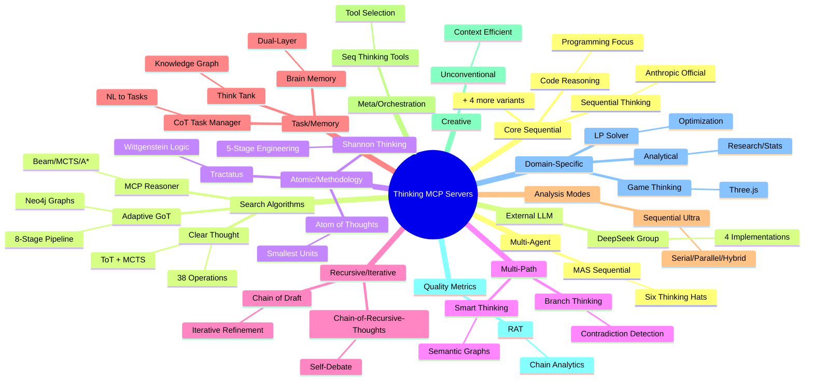
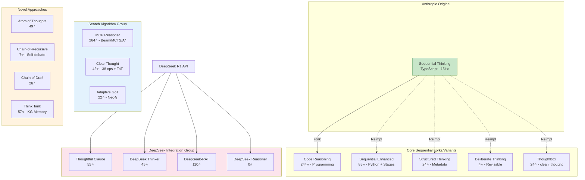
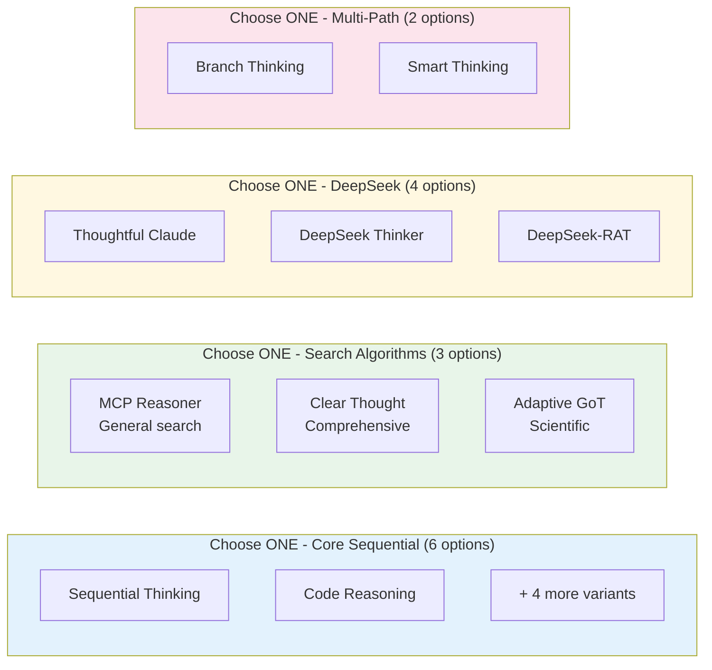
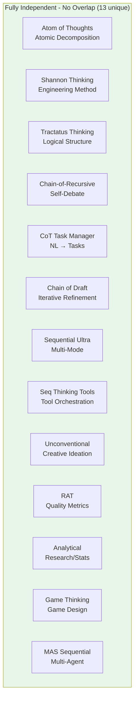
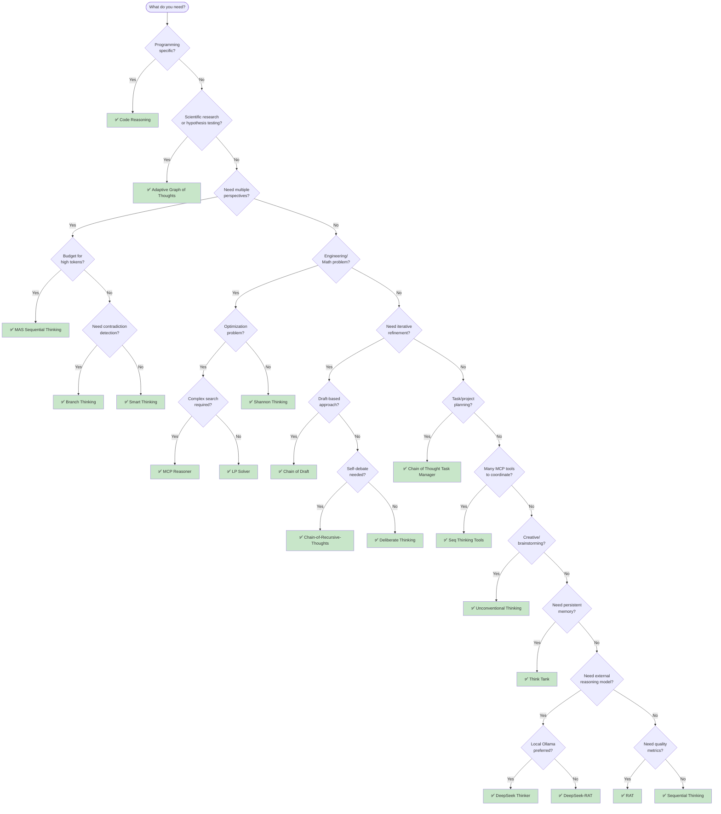
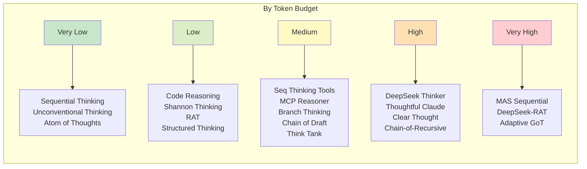
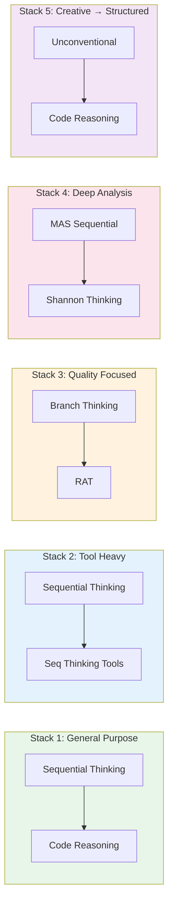
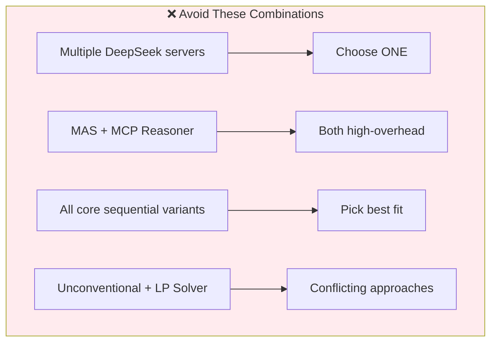

# Chain-of-Thought MCP Servers

A comprehensive survey and analysis of MCP servers for structured reasoning, sequential thinking, and chain-of-thought problem-solving.

> **Data Source**: [PulseMCP - Sequential Thinking Related Servers](https://www.pulsemcp.com/servers/anthropic-sequential-thinking)
> **Full data**: See [servers.json](./servers.json) for complete structured data

---

## At a Glance

**63+ servers on PulseMCP → 32 unique approaches** (rest are clones/simple wrappers)

### Complete Server Overview

| Server                         | Category             | Primary Purpose                      | Best For                                    | Stars |
| ------------------------------ | -------------------- | ------------------------------------ | ------------------------------------------- | ----- |
| **Sequential Thinking**        | Core Sequential      | Step-by-step reasoning               | General-purpose, default choice             | 15k+  |
| **Code Reasoning**             | Core Sequential      | Programming-focused reasoning        | Code analysis, debugging                    | 244   |
| **Sequential Enhanced**        | Core Sequential      | Staged cognitive framework           | Persistent storage, explicit stages         | 85    |
| **Structured Thinking**        | Core Sequential      | Thought stages with metadata         | Transparent step-by-step decisions          | 24    |
| **Deliberate Thinking**        | Core Sequential      | Revisable branching thoughts         | Problems needing course correction          | 4     |
| **Thoughtbox**                 | Core Sequential      | clear_thought tool                   | Clean API for problem decomposition         | 24    |
| **MCP Reasoner**               | Search Algorithms    | Beam/MCTS/A\* search                 | Complex optimization, path finding          | 264   |
| **Clear Thought**              | Search Algorithms    | 38 reasoning operations, ToT + MCTS  | Comprehensive reasoning toolkit             | 42    |
| **Adaptive Graph of Thoughts** | Search Algorithms    | 8-stage Neo4j knowledge graphs       | Scientific research, hypothesis testing     | 22    |
| **Atom of Thoughts**           | Atomic Decomposition | Atomic thought units                 | Fine-grained problem breakdown              | 49    |
| **Shannon Thinking**           | Methodology          | Claude Shannon's 5-stage method      | Engineering, information theory             | 49    |
| **Tractatus Thinking**         | Methodology          | Wittgenstein's logical structures    | Philosophical clarity, hidden dependencies  | -     |
| **Branch Thinking**            | Multi-Path           | Semantic embeddings + contradiction  | Exploring alternatives, detecting conflicts | 1     |
| **Smart Thinking**             | Multi-Path           | Semantic embeddings + thought graphs | Intelligent decision-making                 | 29    |
| **Chain-of-Recursive-Thoughts** | Recursive Debate    | Self-debate across multiple rounds   | Adversarial examination of ideas            | 7     |
| **Chain of Thought Task Mgr**  | Task Management      | Natural language → tasks             | Project planning, requirements breakdown    | 19    |
| **Chain of Draft**             | Iterative Refinement | Draft-based reasoning chains         | Iterative improvement cycles                | 26    |
| **Think Tank**                 | Knowledge Graph      | Persistent knowledge graph           | Cross-session accumulated knowledge         | 57    |
| **Brain Memory System**        | Knowledge Graph      | Dual-layer memory (FIFO + graph)     | Sophisticated memory management             | 1     |
| **Sequential Thinking Ultra**  | Multi-Mode           | Serial/parallel/hybrid modes         | Problems requiring mode switching           | 3     |
| **Seq Thinking Tools**         | Tool Orchestration   | Confidence-scored tool selection     | Coordinating many MCP tools                 | 526   |
| **Unconventional Thinking**    | Creative             | Context-efficient ideation           | Brainstorming, challenging assumptions      | 25    |
| **RAT**                        | Quality Metrics      | Chain quality measurement            | Measurable reasoning quality                | 16    |
| **Analytical**                 | Domain-Specific      | Statistical analysis + research      | Data analysis, research verification        | 4     |
| **Game Thinking**              | Domain-Specific      | Three.js game design                 | Game mechanics iteration                    | 6     |
| **LP Solver**                  | Domain-Specific      | Linear Programming templates         | Optimization problems                       | 5     |
| **Semantic Prompt**            | Configurable         | 3-step configurable process          | Explicit command chains                     | 1     |
| **MAS Sequential**             | Multi-Agent          | 6 agents (Six Thinking Hats)         | Important decisions, comprehensive analysis | 272   |
| **Thoughtful Claude**          | External LLM         | DeepSeek R1 integration              | Quick external reasoning                    | 55    |
| **DeepSeek Thinker**           | External LLM         | DeepSeek + Ollama                    | Local inference                             | 45    |
| **DeepSeek-RAT**               | External LLM         | Two-stage reasoning pipeline         | Sophisticated multi-model workflow          | 110   |
| **DeepSeek Reasoner**          | External LLM         | Basic DeepSeek integration           | Simple external reasoning                   | 0     |

### Overlap Groups (Choose One Per Group)

| Group                    | Servers                                                                               | Guidance                                                                           |
| ------------------------ | ------------------------------------------------------------------------------------- | ---------------------------------------------------------------------------------- |
| **Core Sequential**      | Sequential Thinking, Code Reasoning, Enhanced, Structured, Deliberate, Thoughtbox    | Sequential for general; Code for programming; Enhanced for persistence             |
| **Search Algorithms**    | MCP Reasoner, Clear Thought, Adaptive GoT                                             | Reasoner for general; Clear for toolkit; Adaptive for scientific                   |
| **Multi-Path**           | Branch Thinking, Smart Thinking                                                       | Branch for contradiction detection; Smart for semantic graphs                      |
| **Knowledge Graph**      | Think Tank, Brain Memory System                                                       | Think Tank simpler; Brain Memory for dual-layer architecture                       |
| **External LLM**         | Thoughtful Claude, DeepSeek Thinker, DeepSeek-RAT, DeepSeek Reasoner                  | Thinker for Ollama; Thoughtful for simple; RAT for sophisticated                   |

### Fully Independent (No Overlap)

These servers provide unique capabilities:

- **Atom of Thoughts** - Atomic decomposition into smallest units
- **Shannon Thinking** - Claude Shannon's engineering methodology
- **Tractatus Thinking** - Wittgenstein's logical structure analysis
- **Chain-of-Recursive-Thoughts** - Self-debate reasoning
- **Chain of Thought Task Manager** - NL → task conversion
- **Chain of Draft** - Iterative draft refinement
- **Sequential Thinking Ultra** - Multi-mode analysis
- **Seq Thinking Tools** - Tool orchestration
- **Unconventional Thinking** - Creative ideation
- **RAT** - Quality metrics
- **Analytical** - Statistical/research analysis
- **Game Thinking** - Game design focused
- **MAS Sequential** - Multi-agent parallel reasoning

---

## Table of Contents

1. [At a Glance](#at-a-glance)
2. [Server Landscape](#server-landscape)
3. [Lineage & Relationships](#lineage--relationships)
4. [Which Server Should I Use?](#which-server-should-i-use)
5. [Deployed Servers](#deployed-servers)
6. [Detailed Server Catalog](#detailed-server-catalog)
7. [Complementary Combinations](#complementary-combinations)
8. [Quick Reference](#quick-reference)

---

## Server Landscape

### Capability Mindmap



### Distinct Capabilities (~16 unique approaches)

```mermaid
flowchart TB
    subgraph unique["16 Distinct Capability Categories"]
        direction TB
        A[Core Sequential]
        B[Search Algorithms]
        C[Atomic Decomposition]
        D[Methodology-Specific]
        E[Multi-Path Reasoning]
        F[Recursive Debate]
        G[Task Management]
        H[Iterative Refinement]
        I[Knowledge Graph]
        J[Multi-Mode Analysis]
        K[Tool Orchestration]
        L[Creative Ideation]
        M[Quality Metrics]
        N[Domain-Specific]
        O[Multi-Agent]
        P[External LLM]
    end

    subgraph servers["32 Servers Map To..."]
        direction TB
        A --> s1[6 variants - pick one]
        B --> s2[3 servers - different algorithms]
        C --> s3[Atom of Thoughts]
        D --> s4[Shannon OR Tractatus]
        E --> s5[Branch OR Smart Thinking]
        F --> s6[Chain-of-Recursive-Thoughts]
        G --> s7[CoT Task Manager]
        H --> s8[Chain of Draft]
        I --> s9[Think Tank OR Brain Memory]
        J --> s10[Sequential Thinking Ultra]
        K --> s11[Seq Thinking Tools]
        L --> s12[Unconventional Thinking]
        M --> s13[RAT]
        N --> s14[Analytical, Game, LP Solver]
        O --> s15[MAS Sequential]
        P --> s16[4 DeepSeek variants - pick one]
    end

    style s1 fill:#e1f5fe
    style s2 fill:#e1f5fe
    style s5 fill:#e1f5fe
    style s9 fill:#e1f5fe
    style s16 fill:#fff3e0
    style unique fill:#f5f5f5
```



---

## Lineage & Relationships

### Fork & Reimplementation Tree



### Overlap & Redundancy



### Independence Map



---

## Which Server Should I Use?

### Decision Flowchart



### Quick Selection by Priority



---

## Deployed Servers

Servers currently deployed or ready to deploy in this infrastructure:

### 1. Sequential Thinking (Official Anthropic)

**Status**: Deployed (`mcp/sequentialthinking`)

```
Docker image: mcp/sequentialthinking
Tool: sequentialthinking
```

- Reference implementation - foundation for many forks
- Flexible thought chains with revision/branching support
- General-purpose reasoning
- **Use this unless you have specific needs**

### 2. Code Reasoning

**Status**: Ready (`docker/modules/mcp/thinking/code-reasoning.yaml`)

Repository: https://github.com/mettamatt/code-reasoning (244⭐)

- **Fork of Anthropic's Sequential Thinking**
- Adds prompt templates for coding contexts
- Safety limit: 20 thought steps
- Install: `npx -y @mettamatt/code-reasoning`

### 3. MAS Sequential Thinking

**Status**: Ready (`docker/modules/mcp/thinking/multi-agent-system.yaml`)

Repository: https://github.com/FradSer/mcp-server-mas-sequential-thinking (272⭐)

Six Thinking Hats methodology with specialized agents:

| Agent      | Role                                       |
| ---------- | ------------------------------------------ |
| Factual    | Information retrieval, fact-based analysis |
| Emotional  | Sentiment, human impact                    |
| Critical   | Flaw detection, risk analysis              |
| Optimistic | Opportunity identification                 |
| Creative   | Novel solutions                            |
| Synthesis  | Combines all perspectives                  |

- Supports: DeepSeek, Groq, OpenRouter, GitHub, Ollama
- Install: `uvx mcp-server-mas-sequential-thinking`

### 4. Sequential Thinking Tools

**Status**: Ready (`docker/modules/mcp/thinking/sequentialthinking-tools.yaml`)

Repository: https://github.com/spences10/mcp-sequentialthinking-tools (526⭐)

- Guides tool selection during reasoning
- Confidence-scored recommendations
- Install: `npx -y mcp-sequentialthinking-tools`

---

## Detailed Server Catalog

### Unique/Independent Servers

#### MCP Reasoner

Repository: https://github.com/Jacck/mcp-reasoner (264⭐)

| Algorithm             | Use Case                 |
| --------------------- | ------------------------ |
| Beam Search           | Straightforward problems |
| MCTS                  | Complex scenarios        |
| A\* Search (alpha)    | Path optimization        |
| Bidirectional (alpha) | Dual-direction search    |

**Unique value**: Only server with algorithmic search strategies

---

#### Shannon Thinking

Repository: https://github.com/olaservo/shannon-thinking (49⭐)

Claude Shannon's 5-stage methodology:

```
Problem Definition → Constraints → Model → Proof/Validation → Implementation
```

**Unique value**: Formal engineering methodology with uncertainty quantification

---

#### Branch Thinking

Repository: https://github.com/quanticsoul4772/branch-thinking (1⭐)

| Feature                 | Details                     |
| ----------------------- | --------------------------- |
| Semantic Embeddings     | 384-dim MiniLM vectors      |
| Contradiction Detection | Bloom filters, O(1)         |
| Quality Metrics         | Coherence, information gain |

**Unique value**: Semantic analysis and contradiction detection

---

#### Unconventional Thinking

Repository: https://github.com/stagsz/Unconventional-thinking (25⭐)

- 98.7% context savings via Resources API
- Rebellious thoughts that challenge assumptions
- Branching: extreme, opposite, tangential

**Unique value**: Most context-efficient, best for creative ideation

---

#### RAT (Retrieval-Augmented Thinking)

Repository: https://github.com/stat-guy/retrieval-augmented-thinking (16⭐)

Metrics provided:

- Complexity, Depth, Quality, Impact, Confidence
- Chain effectiveness tracking

**Unique value**: Measurable reasoning quality

---

### Overlapping Servers (Choose One Per Group)

#### Group: Core Sequential

| Server                          | Differentiator           | Choose If...            |
| ------------------------------- | ------------------------ | ----------------------- |
| Sequential Thinking (Anthropic) | Reference, general       | Default choice          |
| Code Reasoning                  | Programming prompts      | Coding tasks            |
| Sequential Enhanced (Arben)     | Python, cognitive stages | Need persistence/stages |

---

#### Group: DeepSeek Integration

| Server            | Differentiator        | Choose If...                |
| ----------------- | --------------------- | --------------------------- |
| DeepSeek Thinker  | Ollama support        | Want local inference        |
| Thoughtful Claude | Simple Python         | Quick integration           |
| DeepSeek-RAT      | Two-stage, OpenRouter | Need sophisticated pipeline |

---

### Domain-Specific

#### LP Solver

Repository: https://github.com/myownipgit/sequential-thinking-lp-solver (5⭐)

- Linear/Non-Linear Programming templates
- More methodology documentation than implementation
- Use MCP Reasoner for more general optimization

---

## Complementary Combinations

### Recommended Stacks



### Complementary Value Matrix

| Combination                 | Overlap | Value     | Verdict                     |
| --------------------------- | ------- | --------- | --------------------------- |
| Sequential + Code Reasoning | High    | Low       | Choose one                  |
| Sequential + Shannon        | Medium  | High      | Different methodologies     |
| MAS + Seq Tools             | Low     | Very High | Perspective + orchestration |
| Reasoner + Branch           | Medium  | Medium    | Both explore paths          |
| DeepSeek × 3                | High    | Low       | Choose one                  |
| Unconventional + MAS        | Low     | High      | Creative + rigorous         |
| Branch + RAT                | Low     | High      | Analysis + metrics          |

### Anti-Patterns



---

## Quick Reference

### Summary Table (32 Unique Servers)

| Server                    | Category          | Tokens    | Unique Value                       |
| ------------------------- | ----------------- | --------- | ---------------------------------- |
| Sequential Thinking       | Core Sequential   | Low       | Reference implementation           |
| Code Reasoning            | Core Sequential   | Low       | Programming prompts                |
| Sequential Enhanced       | Core Sequential   | Low       | Cognitive stages + persistence     |
| Structured Thinking       | Core Sequential   | Low       | Thought metadata tracking          |
| Deliberate Thinking       | Core Sequential   | Low       | Revisable branching                |
| Thoughtbox                | Core Sequential   | Low       | clean_thought API                  |
| MCP Reasoner              | Search            | Medium    | Beam/MCTS/A\* algorithms           |
| Clear Thought             | Search            | Medium    | 38 ops, ToT + MCTS                 |
| Adaptive GoT              | Search            | High      | 8-stage Neo4j graphs               |
| Atom of Thoughts          | Decomposition     | Low       | Atomic thought units               |
| Shannon Thinking          | Methodology       | Low       | Engineering 5-stage                |
| Tractatus Thinking        | Methodology       | Low       | Wittgenstein logical structure     |
| Branch Thinking           | Multi-path        | Medium    | Semantic contradiction detection   |
| Smart Thinking            | Multi-path        | Medium    | Semantic embeddings + graphs       |
| Chain-of-Recursive        | Recursive         | High      | Self-debate reasoning              |
| CoT Task Manager          | Task Management   | Medium    | NL → structured tasks              |
| Chain of Draft            | Iterative         | Medium    | Draft-based refinement             |
| Think Tank                | Knowledge Graph   | Medium    | Persistent KG memory               |
| Brain Memory System       | Knowledge Graph   | Medium    | Dual-layer (FIFO + graph)          |
| Sequential Ultra          | Multi-Mode        | Medium    | Serial/parallel/hybrid             |
| Seq Thinking Tools        | Orchestration     | Medium    | Tool recommendations               |
| Unconventional            | Creative          | Very Low  | Context-efficient ideation         |
| RAT                       | Metrics           | Low       | Quality measurement                |
| Analytical                | Domain-Specific   | Low       | Statistical/research analysis      |
| Game Thinking             | Domain-Specific   | Medium    | Three.js game design               |
| LP Solver                 | Domain-Specific   | Low       | Optimization templates             |
| Semantic Prompt           | Configurable      | Low       | 3-step configurable                |
| MAS Sequential            | Multi-agent       | Very High | 6 perspective agents               |
| Thoughtful Claude         | External LLM      | High      | Simple DeepSeek                    |
| DeepSeek Thinker          | External LLM      | High      | Ollama local                       |
| DeepSeek-RAT              | External LLM      | Very High | Two-stage pipeline                 |
| DeepSeek Reasoner         | External LLM      | High      | Basic integration                  |

### By Maturity

| Level      | Servers                                                                           |
| ---------- | --------------------------------------------------------------------------------- |
| Production | Sequential Thinking, Code Reasoning                                               |
| Stable     | Shannon, Tools, MAS, Thoughtful Claude, MCP Reasoner, Clear Thought               |
| Beta       | DeepSeek-RAT, RAT, Think Tank, Chain of Draft, Adaptive GoT, Atom of Thoughts     |
| Alpha      | Branch Thinking, Unconventional, Chain-of-Recursive, Brain Memory, Tractatus      |

### TL;DR Recommendations

| Need                      | Use                              |
| ------------------------- | -------------------------------- |
| Default/General           | Sequential Thinking              |
| Programming               | Code Reasoning                   |
| Important decisions       | MAS Sequential Thinking          |
| Many MCP tools            | Sequential Thinking Tools        |
| Engineering problems      | Shannon Thinking                 |
| Complex optimization      | MCP Reasoner                     |
| Scientific research       | Adaptive Graph of Thoughts       |
| Comprehensive reasoning   | Clear Thought                    |
| Brainstorming             | Unconventional Thinking          |
| Contradiction detection   | Branch Thinking                  |
| Self-debate               | Chain-of-Recursive-Thoughts      |
| Project planning          | Chain of Thought Task Manager    |
| Iterative refinement      | Chain of Draft                   |
| Cross-session memory      | Think Tank                       |
| Quality metrics           | RAT                              |
| Data analysis             | Analytical                       |
| Game design               | Game Thinking                    |
| Local LLM augmentation    | DeepSeek Thinker + Ollama        |
| Sophisticated multi-model | DeepSeek-RAT                     |
